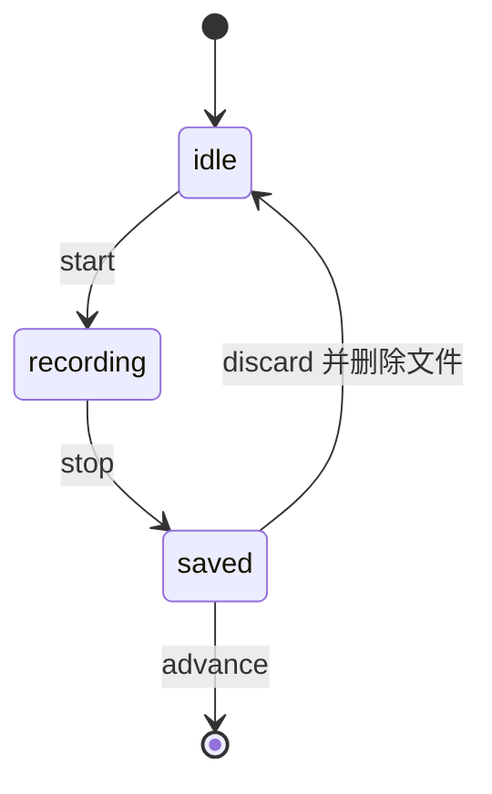

# 后端接口设计文档

版本 v0.8
日期 2026-09-21

本文档描述 D435i 数据采集系统的后端接口契约、数据模型与持久化行为。系统级需求与架构见 `docs/DESIGN.md`，前端页面逻辑见 `docs/FRONTEND.md`。

v0.8 变更点。项目信息对象移除 `session_count`。它原先给主页用，让采集员在开始新一轮前看出选定的目录里已有几轮会话，但这个信息在选择器里已经给过一遍，主页重复展示价值有限，且计数口径难以自洽。移除后 `3.5` 的字段表少一项，`4.1` 的示例同步。

v0.7 变更点。接口设计评审后的一轮修正。创建会话补回相机可用性校验，这是 v0.6 重写时遗失的一项。阶段对象新增 `instructions` 与 `min_duration_s` 与 `max_duration_s`，让会话自描述，避免实时配置与会话快照产生漂移。停止录制与丢弃重录改为幂等，防止响应丢失后的重试被误报为失败。`DELETE` 会话允许作用于已结束的会话。批量上传明确为逐件独立不回滚。`record/start` 的 `bag_path` 更名为 `bag_abs_path`，与录制结果里的相对路径区分开。新增 `PATH_NOT_ALLOWED` 与 `DIR_NOT_WRITABLE` 错误码，目录浏览增加范围限制。

v0.6 变更点。新增项目目录接口与设置持久化。会话新增 `name` 字段，创建会话必须指定名称。新增会话列表接口。健康检查的结构由 `disk` 改为 `project`，因为剩余空间的判定对象变成了项目目录。

v0.5 变更点。阶段对象新增 `recording_started_at` 字段，供刷新后的页面重建计时器。明确推进阶段只能作用于当前阶段，新增 `STAGE_NOT_CURRENT` 错误码。

---

## 1. 通用约定

### 1.1 基础约定

- 基础路径为 `/api`
- 请求与响应均为 JSON，编码 UTF-8
- 唯一的例外是示意图上传，它使用 `multipart/form-data`
- 唯一的二进制响应是 MJPEG 流、JPEG 快照与示意图图片，它们不带 JSON 包装
- 时间戳一律用 ISO 8601 带时区偏移的字符串
- 会话标识 `sid` 格式为 `YYYYMMDD-HHMMSS-xxxx`
- 除预览流与示意图外，所有接口都可返回统一错误体
- 服务端为单例，同一时刻只服务一个采集员，不做鉴权与多租户

### 1.2 错误体

```json
{
  "error": {
    "code": "STAGE_NOT_SAVED",
    "message": "当前阶段尚未保存，不能进入下一阶段",
    "detail": { "stage_index": 3 }
  }
}
```

`code` 是稳定的机器可读标识，前端按它做分支处理。`message` 是给人看的中文说明，可以随版本调整文案，不构成契约。`detail` 可选，携带定位信息。

### 1.3 错误码表

| 码 | HTTP | 含义 |
| --- | --- | --- |
| `DEVICE_NOT_FOUND` | 503 | 未检测到 D435i |
| `DEVICE_BUSY` | 409 | 设备被其他进程占用 |
| `SESSION_NOT_FOUND` | 404 | 会话不存在或已被清理 |
| `SESSION_ACTIVE_EXISTS` | 409 | 已有进行中的会话 |
| `SESSION_FINISHED` | 409 | 会话已结束，不能再对它录制或开预览 |
| `STAGE_NOT_FOUND` | 404 | 阶段序号超出范围 |
| `STAGE_ALREADY_RECORDING` | 409 | 该阶段正在录制 |
| `STAGE_ALREADY_SAVED` | 409 | 该阶段已保存，需先重新录制 |
| `STAGE_NOT_SAVED` | 409 | 该阶段尚未保存 |
| `STAGE_NOT_RECORDING` | 409 | 该阶段未在录制，不能停止 |
| `STAGE_NOT_CURRENT` | 409 | 只能推进当前阶段，该阶段不是当前阶段 |
| `PROJECT_NOT_CONFIGURED` | 409 | 尚未设置项目目录，无法创建会话 |
| `PROJECT_PATH_INVALID` | 400 | 项目目录路径不合法，例如不是绝对路径或含上级目录 |
| `PROJECT_PATH_NOT_WRITABLE` | 403 | 项目目录不可写或无法创建 |
| `PATH_NOT_ALLOWED` | 403 | 路径超出配置允许浏览与写入的范围 |
| `DIR_NAME_INVALID` | 400 | 新建目录的名称不合法 |
| `DIR_NOT_WRITABLE` | 403 | 新建目录的父目录不可写 |
| `DIR_EXISTS` | 409 | 该目录下已存在同名子目录 |
| `DIR_NOT_FOUND` | 404 | 浏览的目录不存在 |
| `DIR_NOT_READABLE` | 403 | 浏览的目录存在但服务无权读取 |
| `SESSION_NAME_REQUIRED` | 400 | 未提供会话名称 |
| `SESSION_NAME_INVALID` | 400 | 会话名称含非法字符或超出长度 |
| `SESSION_DIR_EXISTS` | 409 | 项目目录下已存在同名目录 |
| `RECORDING_TOO_SHORT` | 400 | 录制时长低于最小值，已自动丢弃 |
| `DISK_SPACE_LOW` | 507 | 磁盘剩余空间不足 |
| `CAMERA_ERROR` | 500 | 相机读写异常，例如录制中掉线或取帧失败 |
| `GUIDES_INCOMPLETE` | 409 | 示意图未配置齐全，禁止开始新一轮 |
| `GUIDE_NOT_FOUND` | 404 | 该阶段的示意图尚未上传 |
| `GUIDE_INVALID_IMAGE` | 400 | 文件无法解码为图像 |
| `GUIDE_TOO_LARGE` | 413 | 文件体积超过上限 |
| `GUIDE_UNSUPPORTED_TYPE` | 415 | 文件类型不在白名单内 |

---

## 2. 接口一览

### 2.1 基础

| 方法 | 路径 | 说明 |
| --- | --- | --- |
| GET | `/api/health` | 健康检查，含设备、项目目录与示意图就绪状态 |
| GET | `/api/config` | 读取阶段配置 |

### 2.2 项目目录

| 方法 | 路径 | 说明 |
| --- | --- | --- |
| GET | `/api/project` | 读取项目目录设置与其可用性 |
| PUT | `/api/project` | 设置项目目录，服务校验后落盘 |

### 2.3 目录浏览

供项目目录选择器使用。之所以需要服务端提供，是因为浏览器无法取得主机上的绝对路径，也看不到主机上的目录。详见 `docs/FRONTEND.md` 的项目目录选择器一节。

| 方法 | 路径 | 说明 |
| --- | --- | --- |
| GET | `/api/fs/list` | 列出主机上某个目录的子目录 |
| POST | `/api/fs/mkdir` | 在指定父目录下新建子目录 |

### 2.4 示意图

| 方法 | 路径 | 说明 |
| --- | --- | --- |
| GET | `/api/guides` | 获取示意图清单与就绪状态 |
| POST | `/api/guides/{index}` | 上传或替换单个阶段的示意图 |
| POST | `/api/guides/batch` | 批量上传多张示意图 |
| DELETE | `/api/guides/{index}` | 删除单个阶段的示意图 |
| GET | `/api/guides/{index}/image` | 读取示意图文件 |

### 2.5 会话与录制

| 方法 | 路径 | 说明 |
| --- | --- | --- |
| GET | `/api/sessions` | 列出当前项目下的会话 |
| POST | `/api/sessions` | 新建一轮采集，必须指定名称 |
| GET | `/api/sessions/{sid}` | 查询会话状态 |
| DELETE | `/api/sessions/{sid}` | 丢弃本轮会话 |
| POST | `/api/sessions/{sid}/preview/start` | 进入采集页，启动预览 |
| POST | `/api/sessions/{sid}/preview/stop` | 离开采集页，停止预览 |
| POST | `/api/sessions/{sid}/stages/{index}/record/start` | 开始录制 |
| POST | `/api/sessions/{sid}/stages/{index}/record/stop` | 停止并保存 |
| POST | `/api/sessions/{sid}/stages/{index}/record/discard` | 丢弃并允许重录 |
| POST | `/api/sessions/{sid}/stages/{index}/advance` | 进入下一阶段 |
| GET | `/api/sessions/{sid}/stages/{index}/artifact` | 查询录制结果元信息 |
| GET | `/api/sessions/{sid}/stages/{index}/thumbnail` | 录制首帧缩略图 |

### 2.6 预览

| 方法 | 路径 | 说明 |
| --- | --- | --- |
| GET | `/api/preview/stream` | MJPEG 实时流 |
| GET | `/api/preview/snapshot` | 单帧 JPEG 快照 |

---

## 3. 数据模型

### 3.1 会话对象

所有返回会话的接口使用同一结构。

```json
{
  "session_id": "20260920-143012-a1b2",
  "name": "session_a",
  "created_at": "2026-09-20T14:30:12+08:00",
  "status": "in_progress",
  "current_stage": 1,
  "data_dir": "/Users/ch7au/Documents/Project_A/session_a",
  "stages": [
    {
      "index": 1,
      "name": "正面平视",
      "instructions": "将目标置于画面正中，保持静止，距离约零点五米。",
      "min_duration_s": 1,
      "max_duration_s": 60,
      "state": "idle",
      "allowed_actions": ["start"],
      "recording_started_at": null,
      "artifact": null
    }
  ]
}
```

| 字段 | 类型 | 说明 |
| --- | --- | --- |
| `session_id` | string | 服务生成的会话标识，格式 `YYYYMMDD-HHMMSS-xxxx` |
| `name` | string | 采集员指定的名称，也是磁盘上的目录名 |
| `created_at` | string | 创建时间，ISO 8601 |
| `status` | string | `in_progress` 或 `finished` |
| `current_stage` | int | 当前应处的阶段序号，从一数起 |
| `data_dir` | string | 本轮数据的绝对路径，等于项目目录拼接会话名称 |
| `stages` | array | 阶段对象数组，顺序与配置一致 |

`session_id` 与 `name` 分工不同。`session_id` 由服务生成，永不重复，所有接口用它作为路径参数。`name` 由采集员指定，用来决定目录名，因此在项目内必须唯一。两者都保留是因为目录名需要人可读，而标识需要机器可靠。

`allowed_actions` 由后端单一来源推导，前端只做渲染，从而避免前后端状态判断不一致。

### 3.2 阶段对象

| 字段 | 类型 | 说明 |
| --- | --- | --- |
| `index` | int | 阶段序号，从一数起 |
| `name` | string | 阶段名称，来自 YAML 配置 |
| `instructions` | string | 操作说明，来自 YAML 配置 |
| `min_duration_s` | int | 低于该时长的录制会被丢弃，来自 YAML 配置 |
| `max_duration_s` | int | 超过该时长后端自动停止并保存，来自 YAML 配置 |
| `state` | string | `idle` 或 `recording` 或 `saved` |
| `allowed_actions` | string[] | 当前状态下允许的动作，取值 `start` 与 `stop` 与 `discard` 与 `advance` |
| `recording_started_at` | string\|null | 录制中为该次录制的起始时刻，否则为 `null` |
| `artifact` | object\|null | 保存后填充，结构见 3.3 |

`recording_started_at` 是给刷新场景用的。浏览器在录制途中刷新后，只能从会话对象拿回状态，拿不到 `record/start` 当时的返回值，靠这个字段才能重建已录时长，不然计时器只能从零重新开始。

**为什么名称与时长放在阶段对象里**。它们来自会话创建时冻结的配置快照，因此与后端实际执行的限制一致。前端若去读实时的 `/api/config`，中途改了 YAML 就会出现界面显示 30 秒倒计时而后端按 60 秒停止这类不一致。会话一旦建立，阶段相关的文案与限制就以会话对象为准，`/api/config` 只服务于还没有会话时的界面。

### 3.2.1 会话摘要

用在不需要完整阶段列表的场合，例如主页的活动会话提示与会话列表。

```json
{
  "session_id": "20260920-143012-a1b2",
  "name": "session_a",
  "created_at": "2026-09-20T14:30:12+08:00",
  "finished_at": null,
  "status": "in_progress",
  "current_stage": 3,
  "saved_count": 2,
  "size_bytes": 382730240,
  "data_dir": "/Users/ch7au/Documents/Project_A/session_a"
}
```

| 字段 | 类型 | 说明 |
| --- | --- | --- |
| `finished_at` | string\|null | 结束时刻，未结束为 `null` |
| `current_stage` | int | 当前应处的阶段序号 |
| `saved_count` | int | 已保存阶段的数量 |
| `size_bytes` | int | 本轮已落盘的字节总数 |

### 3.3 录制结果

阶段状态为 `saved` 时，`artifact` 字段的结构如下。

```json
{
  "bag_path": "stage_01/capture.bag",
  "size_bytes": 184320512,
  "duration_s": 12.4,
  "started_at": "2026-09-20T14:31:02+08:00",
  "stopped_at": "2026-09-20T14:31:14+08:00",
  "streams": ["depth", "color", "infrared_1", "infrared_2", "accel", "gyro"],
  "frame_counts": { "depth": 372, "color": 372, "accel": 781, "gyro": 2480 },
  "thumbnail_url": "/api/sessions/20260920-143012-a1b2/stages/1/thumbnail"
}
```

| 字段 | 类型 | 说明 |
| --- | --- | --- |
| `bag_path` | string | 相对于会话目录的路径，不是绝对路径。绝对路径等于 `data_dir` 拼接该值 |
| `size_bytes` | int | bag 文件字节数 |
| `duration_s` | float | 实际录制时长，单位秒 |
| `started_at` | string | 开始录制时刻 |
| `stopped_at` | string | 停止录制时刻 |
| `streams` | string[] | 本次录制包含的流，与 YAML 的录制配置一致 |
| `frame_counts` | object | 各流的帧数统计，用于快速判断是否丢帧 |
| `thumbnail_url` | string | 缩略图地址，取自录制期最后一帧 |

`streams` 与 `frame_counts` 是刻意保留的。采集完成后若发现某一路帧数明显偏低，可以直接判定为 USB 带宽或设备异常，不需要重新打开 bag 逐帧检查。

### 3.4 示意图条目

```json
{
  "index": 1,
  "name": "正面平视",
  "configured": true,
  "image_url": "/api/guides/1/image",
  "original_filename": "guide_01.png",
  "content_type": "image/png",
  "size_bytes": 248320,
  "width": 1920,
  "height": 1080,
  "uploaded_at": "2026-09-21T09:12:03+08:00",
  "sha256": "3ab1..."
}
```

未配置时，`configured` 为 `false`，其余字段除 `index` 与 `name` 外全部为 `null`。

`sha256` 有两个用途。一是前端的缓存指纹，二是判断素材是否被替换过。

### 3.5 项目信息

描述采集数据的存放地，以及它当前是否可用。

```json
{
  "configured": true,
  "root": "/Users/ch7au/Documents/Project_A",
  "name": "Project_A",
  "exists": true,
  "writable": true,
  "free_gb": 62.5,
  "enough": true,
  "error": null
}
```

| 字段 | 类型 | 说明 |
| --- | --- | --- |
| `configured` | bool | 是否已经设置过项目目录 |
| `root` | string\|null | 绝对路径，未设置时为 `null` |
| `name` | string\|null | 路径的最后一段，仅供界面显示 |
| `exists` | bool | 目录是否存在，不存在时由服务创建 |
| `writable` | bool | 服务是否有写入权限 |
| `free_gb` | number | 该卷的剩余空间，单位 GB |
| `enough` | bool | 剩余空间是否高于配置的阈值 |
| `error` | string\|null | 不可用时的原因，可用时为 `null` |

`error` 是一句给人看的中文说明。前端直接展示它，不需要自己拼原因文案，因为只有服务知道到底是权限问题还是空间问题。

### 3.6 目录条目与列表

供项目目录选择器使用。服务只列子目录，不列文件，因为项目目录必须是一个目录，列出文件只会增加噪音。

```json
{
  "path": "/Users/ch7au/Documents",
  "parent": "/Users/ch7au",
  "name": "Documents",
  "home": "/Users/ch7au",
  "shortcuts": [
    { "name": "Home", "path": "/Users/ch7au" },
    { "name": "Documents", "path": "/Users/ch7au/Documents" }
  ],
  "readable": true,
  "writable": true,
  "free_gb": 62.5,
  "enough": true,
  "error": null,
  "entries": [
    { "name": "Project_A", "path": "/Users/ch7au/Documents/Project_A", "writable": true, "is_symlink": false, "looks_like_session": false },
    { "name": "session_a", "path": "/Users/ch7au/Documents/Project_A/session_a", "writable": true, "is_symlink": false, "looks_like_session": true }
  ]
}
```

| 字段 | 类型 | 说明 |
| --- | --- | --- |
| `path` | string | 当前目录的绝对路径，已规范化 |
| `parent` | string\\|null | 上级目录，已在文件系统根时为 `null` |
| `name` | string | 当前目录名，根目录时为 `/` |
| `home` | string | 服务运行用户的主目录，供选择器定位 |
| `shortcuts` | array | 常用位置快捷入口，由服务决定，不硬编码在前端 |
| `readable` | bool | 服务是否有读取权限 |
| `writable` | bool | 服务是否有写入权限 |
| `free_gb` | number | 该卷剩余空间，单位 GB |
| `enough` | bool | 剩余空间是否达到项目目录的阈值 |
| `error` | string\\|null | 不可用作项目目录时的原因，可用时为 `null` |
| `entries` | array | 子目录列表，按名称自然序排序 |

`entries` 里每个条目的字段如下。

| 字段 | 类型 | 说明 |
| --- | --- | --- |
| `name` | string | 目录名 |
| `path` | string | 完整路径，前端直接拿来请求下一级 |
| `writable` | bool | 服务是否可写，不可写的条目仍然返回，由前端标出而不是直接隐去 |
| `is_symlink` | bool | 是否为符号链接，前端会加个标记提示 |
| `looks_like_session` | bool | 该目录下是否存在 `session.json` |

`looks_like_session` 由服务判定而不是让前端去猜。选择器需要在选定目录前提示“这里已经有几轮会话”，而前端要自己判断的话得逐个目录再发请求，成本比服务顺手多说一个布尔值高得多。

四个刻意的决定。

第一，`parent` 由服务给出，前端不自己拼接路径。路径拼接的边界情况比看上去多，例如根目录、重复斜杠、末尾斜杠，集中在一处处理比前端到处拼字符串可靠。

第二，不可写的子目录仍然返回。直接把它们过滤掉会让人以为目录不存在，返回并标记 read only 更接近事实，也便于排查权限问题。

第三，符号链接标记出来但不追踪。选择器不跟随链接，避免因为循环链接把浏览卡死。

第四，越出允许范围的目录由 `parent` 与 `PATH_NOT_ALLOWED` 共同表达，详见 4.5。

### 3.7 状态与动作

阶段状态机是后端契约，前端的按钮呈现只是它的投影。

| 状态 | 含义 | `start` | `stop` | `discard` | `advance` |
| --- | --- | --- | --- | --- | --- |
| `idle` | 尚未录制 | 允许 | 拒绝 `STAGE_NOT_RECORDING` | 拒绝 `STAGE_NOT_SAVED` | 拒绝 `STAGE_NOT_SAVED` |
| `recording` | 正在录制 | 拒绝 `STAGE_ALREADY_RECORDING` | 允许 | 拒绝 `STAGE_NOT_SAVED` | 拒绝 `STAGE_NOT_SAVED` |
| `saved` | 已保存 | 拒绝 `STAGE_ALREADY_SAVED` | 拒绝 `STAGE_NOT_RECORDING` | 允许 | 允许 |



`allowed_actions` 就是上表中标记为允许的那些动作，顺序固定为 `start` 与 `stop` 与 `discard` 与 `advance`。

---

## 4. 基础与设置接口

### 4.1 健康检查

`GET /api/health`

响应 200

```json
{
  "status": "ok",
  "device": {
    "connected": true,
    "name": "Intel RealSense D435i",
    "serial": "0123456789",
    "firmware": "5.13.0.50",
    "usb_type": "3.2",
    "reason": null
  },
  "project": {
    "configured": true,
    "root": "/Users/ch7au/Documents/Project_A",
    "name": "Project_A",
    "exists": true,
    "writable": true,
    "free_gb": 62.5,
    "enough": true,
    "error": null
  },
  "guides": {
    "ready": true,
    "uploaded": 8,
    "total": 8,
    "missing_indices": []
  },
  "active_session": {
    "session_id": "20260920-143012-a1b2",
    "name": "session_a",
    "created_at": "2026-09-20T14:30:12+08:00",
    "finished_at": null,
    "status": "in_progress",
    "current_stage": 3,
    "saved_count": 2,
    "size_bytes": 382730240,
    "data_dir": "/Users/ch7au/Documents/Project_A/session_a"
  }
}
```

| 字段 | 说明 |
| --- | --- |
| `status` | 三项前置条件均满足时为 `ok`，否则为 `degraded` |
| `device.connected` | 相机是否被检测到 |
| `device.usb_type` | 连接速率，非 3.x 时前端应给出提示 |
| `device.reason` | 未连接时的原因，例如被其他进程占用 |
| `project` | 项目目录设置与可用性，结构见 3.5 |
| `guides.ready` | 八个阶段示意图是否全部已配置 |
| `active_session` | 进行中会话的摘要，无则为 `null`。结构见 3.2.1 |

相机未连接时 HTTP 仍返回 200，只是 `status` 变为 `degraded`，方便前端展示原因而不是直接报错。

这个接口是主页的唯一数据源。前端一次请求就能同时拿到相机状态、项目目录、示意图进度与进行中会话，不需要并发拉四个接口。

`active_session` 从标识改为摘要对象是刻意的。主页需要展示已保存阶段数与目录路径，只给一个标识的话前端还得再发一次请求。

### 4.2 读取配置

`GET /api/config`

响应 200

```json
{
  "app_title": "D435i 数据采集",
  "total_stages": 8,
  "preview": { "fps": 15, "jpeg_quality": 80 },
  "recording": { "min_duration_s": 1, "max_duration_s_default": 300 },
  "stages": [
    {
      "index": 1,
      "name": "正面平视",
      "instructions": "将目标置于画面正中，距离保持在零点五米左右。",
      "max_duration_s": 60
    }
  ]
}
```

| 字段 | 说明 |
| --- | --- |
| `recording.min_duration_s` | 低于该时长的录制会被丢弃，全局设置 |
| `recording.max_duration_s_default` | 单个阶段未单独配置时长时的上限 |
| `stages[].max_duration_s` | 该阶段的上限，覆盖全局默认值 |

这个接口的定位要说清楚。它服务于**还没有会话时**的界面，也就是主页与示意图配置页，那些地方需要提前知道共几个阶段、叫什么名字。

会话建立之后，阶段相关的文案与时长以会话里的阶段对象为准，见 3.2。两处的值可能不同，因为会话里的是创建时冻结的快照，而这里是实时的。前端不能把这两者混用。

`min_duration_s` 需要暴露出来，否则前端无法在录制时提示“再录一会儿”，只能等提交后报错。

该接口只暴露前端需要的配置项，不含相机参数与文件路径等敏感或无关内容。

阶段名称与操作说明只能改 YAML 并重启服务，它们不在界面上编辑。理由这些文案属于采集流程定义，改动应当留下痕迹，不适合在网页上随手改。

### 4.3 读取项目目录

`GET /api/project`

响应 200 返回项目信息对象，结构见 3.5。

未设置过项目目录时返回 `configured` 为 `false` 且 `root` 为 `null` 的对象，HTTP 仍为 200。这种情况不是错误，而是首次启动的正常状态。

### 4.4 设置项目目录

`PUT /api/project`

请求体

```json
{ "root": "/Users/ch7au/Documents/Project_A" }
```

服务行为。

1. 校验路径合法。必须是绝对路径或以 `~` 开头，不允许包含 `..`，不允许是文件系统根。不合法返回 400 与 `PROJECT_PATH_INVALID`
2. 展开 `~` 为主机用户主目录
3. 校验路径在允许范围内，越界则 403 与 `PATH_NOT_ALLOWED`
4. 目录不存在时创建，含中间层级的父目录
5. 校验可写性，实际写一个临时文件再删除，不可写则 403 与 `PROJECT_PATH_NOT_WRITABLE`
6. 探测该卷的剩余空间，低于配置阈值则 507 与 `DISK_SPACE_LOW`
7. 写入设置文件并返回解析后的绝对路径

响应 200 返回更新后的项目信息对象。响应里的 `root` 是展开且规范化之后的绝对路径，可能与请求里的写法不同，前端应当用返回值刷新界面而不是沿用自己输入的文字。

任一步骤失败都不写入设置文件，旧值保持不变。这意味着一次失败的修改不会把采集员的可工作状态弄坏。

校验顺序是刻意的。先做不碰磁盘的合法性校验，再创建目录，最后才探测空间，这样错误的路径不会在磁盘上留下垃圾目录。

第 3 步的允许范围与目录浏览用同一份配置。它的作用是把采集员能写的位置限制在合理范围内，避免把项目目录指到系统目录上。若当前已配置的项目目录不在允许范围内，服务启动时把它自动补进去，这样已有的合法配置不会因为收紧限制而失效。

### 4.5 浏览目录

`GET /api/fs/list`

供项目目录选择器使用。这一组接口存在的原因值得写清楚。浏览器没有任何方式取得主机上的绝对路径，原生目录选择框浏览的又是打开浏览器的那台机器，而不是插着相机的主机。因此列出主机目录这件事只能由服务来做。

查询参数

| 参数 | 必填 | 说明 |
| --- | --- | --- |
| `path` | 否 | 要列出的目录。省略时从服务运行用户的主目录开始 |
| `show_hidden` | 否 | 是否包含以点开头的目录，默认为 `false` |

响应 200 返回目录列表对象，结构见 3.6。

路径不存在时返回 404 与 `DIR_NOT_FOUND`。存在但服务无权读取时返回 403 与 `DIR_NOT_READABLE`。越出允许范围时返回 403 与 `PATH_NOT_ALLOWED`。

**允许范围**。服务按配置里的 `fs.allow_roots` 决定可浏览的根部，默认为服务用户主目录、`/Volumes`、`/media`、`/mnt`。这个限制的目的是避免采集员误把项目目录指到系统目录上，而不是当成一道安全边界，因为这套服务本身不做鉴权。

越界有两种表现，前端不需要额外处理。请求一个范围内的目录时，响应的 `parent` 在到达范围根部时返回 `null`，这与文件系统根的表现完全一致，选择器的 Up 按钮因此自然变灰。请求一个范围外的目录时，直接返回 403 与 `PATH_NOT_ALLOWED`。

另外，当前已配置的项目目录始终视为在范围内，防止收紧配置后把正在用的工作目录锁在外面。

需要注意的是这个接口只读不写，也不会创建目录。列出一个不存在的目录不会顺带把它建出来，创建只发生在 `PUT /api/project` 与 `POST /api/fs/mkdir` 两处。

`path` 会被规范化，因此 `/Users/a/./b` 与 `/Users/a/b` 返回同一份结果，`..` 也会被解析掉。规范化的结果在响应的 `path` 字段里给出，前端应当用它而不是用自己请求时传的字符串。

### 4.6 新建目录

`POST /api/fs/mkdir`

在指定父目录下创建一个子目录，供选择器里的 New folder 使用。它只创建一层，不递归。

请求体

```json
{ "parent": "/Users/ch7au/Documents", "name": "Project_C" }
```

服务行为。

1. 校验名称合法。规则与会话名称完全相同，字母数字点划下划线，首字符为字母或数字，长度不超过 64。不合法返回 400 与 `DIR_NAME_INVALID`
2. 校验父目录在允许范围内，否则 403 与 `PATH_NOT_ALLOWED`
3. 校验父目录存在，否则 404 与 `DIR_NOT_FOUND`
4. 校验父目录可写，否则 403 与 `DIR_NOT_WRITABLE`
5. 校验同名子目录不存在，否则 409 与 `DIR_EXISTS`
6. 创建目录

响应 201

```json
{
  "path": "/Users/ch7au/Documents/Project_C",
  "listing": { "...": "父目录的列表对象，结构见 3.6" }
}
```

响应里带上父目录的完整列表，这样前端创建完不必再发一次请求去刷新列表。前端拿到 `path` 之后自行决定是进入新目录还是留在原地，两种行为都不需要额外请求。

状态码用 201 而不额外带一个 `created` 布尔字段，两者表意重复。

名称规则与会话名称共用一套，这一点是刻意对齐的。在选择器里能建出来的目录，一定可以直接用作会话名，不会出现能建但建完却不能用的尴尬情况。

---

## 5. 示意图接口

示意图是全局资源，不属于任何一轮会话，也不参与任何录制过程。因此这一组接口与会话完全独立，任何时候都可调用。

### 5.1 清单与就绪状态

`GET /api/guides`

主页与配置页共用这一个接口。响应里同时给出清单与就绪判断，前端不需要自己算。

响应 200

```json
{
  "required": true,
  "ready": false,
  "total": 8,
  "uploaded": 6,
  "missing_indices": [3, 7],
  "guides": [
    {
      "index": 1,
      "name": "正面平视",
      "configured": true,
      "image_url": "/api/guides/1/image",
      "original_filename": "guide_01.png",
      "content_type": "image/png",
      "size_bytes": 248320,
      "width": 1920,
      "height": 1080,
      "uploaded_at": "2026-09-21T09:12:03+08:00",
      "sha256": "3ab1..."
    },
    {
      "index": 3,
      "name": "俯视",
      "configured": false,
      "image_url": null,
      "original_filename": null,
      "content_type": null,
      "size_bytes": null,
      "width": null,
      "height": null,
      "uploaded_at": null,
      "sha256": null
    }
  ]
}
```

`ready` 为 `true` 的条件是八个阶段全部 `configured`，且 `required` 为 `true` 时这个值才参与会话创建拦截。`missing_indices` 直接给前端做定位跳转用。

这个状态来自磁盘上的持久化清单，而不是内存里临时累积的结果。因此服务重启、机器重启、换浏览器之后，返回的都还是同一份状态。前端据此渲染主页，就能做到已配置齐全时不提示配置。

### 5.2 上传或替换单个示意图

`POST /api/guides/{index}`

请求为 `multipart/form-data`，字段名为 `file`。

校验顺序如下，任一失败都不写入磁盘，并保留原有示意图。

1. `index` 在阶段范围内，否则 404 与 `STAGE_NOT_FOUND`
2. 内容类型在 `allowed_types` 内，否则 415 与 `GUIDE_UNSUPPORTED_TYPE`
3. 体积不超过 `max_size_mb`，否则 413 与 `GUIDE_TOO_LARGE`
4. 能被图像库解码，否则 400 与 `GUIDE_INVALID_IMAGE`

全部通过后写入配置的示意图目录并更新清单。若该阶段已有示意图，则为替换语义，旧文件被覆盖。若原图宽度大于 `display_max_width`，额外生成一份展示副本供引导页使用。

响应 200

```json
{
  "index": 1,
  "configured": true,
  "image_url": "/api/guides/1/image",
  "original_filename": "guide_01.png",
  "content_type": "image/png",
  "size_bytes": 248320,
  "width": 1920,
  "height": 1080,
  "uploaded_at": "2026-09-21T09:12:03+08:00",
  "sha256": "3ab1...",
  "generated_preview": true,
  "ready": false
}
```

响应里带上 `ready` 与整体进度，前端上传完一张后不需要额外请求就能刷新进度条。

### 5.3 批量上传

`POST /api/guides/batch`

请求为 `multipart/form-data`，每个文件部件的字段名形如 `stage_1` 与 `stage_3`，字段名决定归属阶段。这种显式命名比让后端去猜文件名更可靠，猜测归属的交互由前端完成。

```text
--boundary
Content-Disposition: form-data; name="stage_1"; filename="a.png"
Content-Type: image/png

<binary>
--boundary
Content-Disposition: form-data; name="stage_3"; filename="c.jpg"
Content-Type: image/jpeg

<binary>
--boundary--
```

语义是**逐件独立处理，部分成功不回滚**。后端对每个部件分别跑完 5.2 的四项校验，通过的立即写入，未通过的记入 `failed`，已经写好的不会因为后面某个文件失败而被撤销。

这一点与 `5.2` 单件上传不一致的地方要特别留意。单件上传是全部校验通过才写入，因为只有一个文件，不存在部分概念。批量上传则是一个便利接口，不做事务。

响应 200

```json
{
  "applied": [1, 3],
  "failed": [],
  "guides": { "...": "与 5.1 响应相同结构" }
}
```

存在失败项时状态码仍为 200，失败详情在 `failed` 里逐条给出 `index` 与错误码。

```json
{
  "applied": [1],
  "failed": [{ "index": 3, "code": "GUIDE_INVALID_IMAGE", "message": "无法解码为图像" }],
  "guides": { "...": "与 5.1 响应相同结构" }
}
```

不用 207 的原因是全套接口的结果约定统一为：业务层面的部分成功仍算成功，HTTP 状态码只用来表达请求本身是否被受理。`failed` 数组就是表达部分失败的地方，前端读它而不是读状态码。这样也不用把 WebDAV 对 207 响应体的规定牵扯进来。

### 5.4 删除单个示意图

`DELETE /api/guides/{index}`

后端行为。

1. 校验该阶段已配置，否则 404 与 `GUIDE_NOT_FOUND`
2. 删除原图与展示副本
3. 从清单移除条目

响应 200

```json
{ "index": 1, "configured": false, "ready": false, "uploaded": 7 }
```

删除不影响任何一轮已完成的会话数据，因为示意图只在引导页展示时读取。

### 5.5 读取示意图

`GET /api/guides/{index}/image`

用于引导页显示与配置页缩略图。默认返回展示副本，尺寸和体积更适合网页加载。

查询参数

| 参数 | 取值 | 说明 |
| --- | --- | --- |
| `size` | `display` 或 `original` | 默认为 `display`，取展示副本，缺省时回退到原图 |
| `v` | 字符串 | 内容指纹，即 `sha256` 前八位，用于刷新浏览器缓存 |

响应 200 返回 `image/png` 或 `image/jpeg`。未配置时返回 404 与 `GUIDE_NOT_FOUND`。

`v` 参数只影响缓存键，服务端不校验它的取值。

---

## 6. 会话与录制接口

### 6.1 列出会话

`GET /api/sessions`

列出当前项目目录下的会话。前端用它在新建会话前做重名校验，同时这也是以后做会话浏览页的数据源。

响应 200

```json
{
  "project_root": "/Users/ch7au/Documents/Project_A",
  "sessions": [
    {
      "session_id": "20260920-143012-a1b2",
      "name": "session_a",
      "created_at": "2026-09-20T14:30:12+08:00",
      "finished_at": "2026-09-20T14:58:41+08:00",
      "status": "finished",
      "current_stage": 8,
      "saved_count": 8,
      "size_bytes": 1623453696,
      "data_dir": "/Users/ch7au/Documents/Project_A/session_a"
    }
  ]
}
```

列表同时包含两类条目。一类是服务当前持有的会话，状态准确。另一类是磁盘上已经存在但服务没有加载的目录，例如上次运行留下的已结束会话，这些条目的 `session_id` 复用目录名，`saved_count` 与 `size_bytes` 可能为 0，因为服务没有逐个打开去统计。

这两类条目对前端的用途相同，就是给出已被占用的名称。不要依赖这个接口去展示体积统计，它只保证名称完整。

未设置项目目录时 `project_root` 为 `null`，`sessions` 为空数组。

### 6.2 新建会话

`POST /api/sessions`

请求体

```json
{ "name": "session_a", "operator": "zhangsan", "note": "批次 A" }
```

`name` 必填，`operator` 与 `note` 可选，默认留空。

创建前有六项校验，任一不满足都不创建会话。

1. 相机可用，否则 503 与 `DEVICE_NOT_FOUND`，或 409 与 `DEVICE_BUSY`
2. 项目目录已设置且可用，否则 409 与 `PROJECT_NOT_CONFIGURED`，或 403 与 `PROJECT_PATH_NOT_WRITABLE`，或 507 与 `DISK_SPACE_LOW`
3. 无进行中的会话，否则 409 与 `SESSION_ACTIVE_EXISTS`，`detail.session` 里给出进行中会话的摘要
4. 八个阶段的示意图全部已配置，否则 409 与 `GUIDES_INCOMPLETE`，`detail.missing_indices` 里给出缺失的阶段
5. 名称合法，否则 400 与 `SESSION_NAME_REQUIRED` 或 `SESSION_NAME_INVALID`
6. 项目目录下无同名目录，否则 409 与 `SESSION_DIR_EXISTS`，`detail.name` 与 `detail.data_dir` 里给出冲突位置

相机检查放在第一位是因为它是唯一一个前端无法自己发现后就地解决的问题。项目目录不对、示意图没配齐、名字重了，采集员都能在当前页面改掉再重试，而相机插不上就只能去找硬件。早一点报出来，就少一次白填表单。

名称规则如下。合法字符是字母、数字、点、短横线与下划线，首字符必须是字母或数字，长度不超过 64。不接受路径分隔符、`..` 与开头的点，因此任何合法名称都不可能指向项目目录之外。

响应 201 返回会话对象。

在项目目录下创建 `<name>/` 与它的 `stage_XX` 子目录，写入 `session.json`，并冻结一份当次生效的配置快照。快照里的阶段名称、操作说明与时长上下限随后会随会话对象一并返回，见 3.2。

示意图校验由配置项 `guides.required` 控制，置为 `false` 时仅告警不拦截。

并发冲突时返回 409 与 `SESSION_ACTIVE_EXISTS`，响应体附带进行中会话的摘要供前端提示。

### 6.3 查询会话

`GET /api/sessions/{sid}`

响应 200 返回会话对象。会话不存在时返回 404 与 `SESSION_NOT_FOUND`。

该接口对已结束的会话同样有效，返回 `status` 为 `finished` 且 `finished_at` 已填充的对象。结束页依赖这一点，让采集员在误刷新后还能拿回本轮汇总。

这是前端刷新页面后恢复状态的唯一依据。采集页在录制期间每两秒轮询一次，用于感知后端自动停止保存这类前端不掌握的变化。

### 6.4 丢弃会话

`DELETE /api/sessions/{sid}`

后端行为。

1. 校验会话存在且无任何阶段处于 `recording`，否则 404 与 `SESSION_NOT_FOUND` 或 409 与 `STAGE_ALREADY_RECORDING`
2. 删除整个会话目录，包含已保存的 bag 与元数据
3. 清理内存中的会话状态

已结束的会话同样可以删除。采集员录完一轮之后发现整批都不要了，是正常需求，没有理由拦着。这个接口按 `DELETE` 的惯例设计成幂等，已经不存在也算成功，这对重试友好。

响应 200

```json
{ "session_id": "20260920-143012-a1b2", "deleted": true, "removed_dir": "/Users/ch7au/Documents/Project_A/session_a" }
```

磁盘目录被删除是不可逆操作，前端必须二次确认。为避免误删，也可以只把会话标记为废弃而不真正删除文件，是否采用由部署时的清理策略决定。

### 6.5 启动预览

`POST /api/sessions/{sid}/preview/start`

进入采集页时调用。后端按预览配置启动 pipeline，并把最新帧槽位置为有效。重复调用是幂等的。

会话已结束时返回 409 与 `SESSION_FINISHED`。结束的会话没有预览可开，结束页也不需要。

响应 200

```json
{ "streaming": true, "stream_url": "/api/preview/stream" }
```

预览只开彩色流，不开 IMU。IMU 频率远高于图像，放进同步组会拖慢取帧节奏并引入丢帧，而预览并不需要它。

### 6.6 停止预览

`POST /api/sessions/{sid}/preview/stop`

离开采集页时调用。

**请求体必须允许为空**。前端在页面卸载时用 `navigator.sendBeacon` 发这个请求，它不支持自定义请求头，也不会携带任何数据。实现时这个路由不能声明需要 Pydantic 请求体，否则 FastAPI 会回一个 422，而 422 不是本服务的统一错误体格式，前端会认不出来。

这个接口是幂等的，重复调用或对已结束的会话调用都返回成功，不报 `SESSION_FINISHED`。理由同上，它会在页面卸载时被发出，此时可能已经挡不住一次重复请求，报错也没有人能处理。

后端行为。

1. 若当前正在录制，先自动停止并保存，再关闭 pipeline
2. 关闭 pipeline，释放设备句柄
3. 把最新帧槽位置为无效

响应 200

```json
{ "streaming": false, "auto_saved": true }
```

`auto_saved` 表示本次调用顺带完成了自动保存。这一步是防止产生半截 bag 文件的关键。

### 6.7 开始录制

`POST /api/sessions/{sid}/stages/{index}/record/start`

请求体可为空，或携带备注。

```json
{ "note": "目标静止" }
```

后端行为。

1. 校验会话未结束，已结束则 409 与 `SESSION_FINISHED`
2. 校验阶段状态为 `idle`
3. 校验磁盘剩余空间，不足则 507 与 `DISK_SPACE_LOW`
4. 停止预览 pipeline，检查无残留句柄
5. 按录制配置启动 pipeline，并挂上录制文件。启动失败则 500 与 `CAMERA_ERROR`
6. 阶段状态置为 `recording`，记录开始时间

响应 200

```json
{
  "stage_index": 1,
  "state": "recording",
  "started_at": "2026-09-20T14:31:02+08:00",
  "bag_abs_path": "/Users/ch7au/Documents/Project_A/session_a/stage_01/capture.bag",
  "auto_stop_at_s": 60
}
```

字段名为 `bag_abs_path` 而不是 `bag_path`，因为它是绝对路径，而 3.3 里的 `bag_path` 是相对会话目录的。两个名字不能混用，否则很容易把相对路径直接当绝对路径去用。

`auto_stop_at_s` 是相对开始时刻的秒数，取自会话冻结快照里的 `max_duration_s`。前端据此显示倒计时。后端在超时时自行停止并保存。

因为涉及 pipeline 重启，这个接口有约一秒的耗时，前端需要显示加载态，并在预览区盖一层遮罩。切换机制见 `docs/DESIGN.md` 的相机与录制设计一节。

### 6.8 停止录制

`POST /api/sessions/{sid}/stages/{index}/record/stop`

后端行为。

1. 阶段状态为 `saved` 时直接返回已有的 `artifact`，不做任何改动
2. 校验阶段状态为 `recording`，否则 409 与 `STAGE_NOT_RECORDING`
3. 停止 pipeline，SDK 在此刻 flush 并关闭 bag 文件
4. 读取文件大小与时长，写入 `meta.json`
5. 抓取录制期最后一帧存为缩略图
6. 阶段状态置为 `saved`
7. 按预览配置重启 pipeline，恢复预览

第 1 条是这个接口幂等的地方，它是刻意设计的，也是最容易被实现成不幂等的一处。

设想一种常见情形。请求已经发到后端，后端也确实停下来并把这条保存好了，但响应在网络上丢了，前端超时。采集员看到保存失败，于是再点一次停止。如果第二次报 `STAGE_NOT_RECORDING`，界面就告诉他失败了，他会以为需要重录，白白多录一遍。反过来，第二次返回 200 与已有的 `artifact`，界面就正常提示已保存，数据与界面一致。

响应 200

```json
{
  "stage_index": 1,
  "state": "saved",
  "artifact": {
    "bag_path": "stage_01/capture.bag",
    "size_bytes": 184320512,
    "duration_s": 12.4,
    "started_at": "2026-09-20T14:31:02+08:00",
    "stopped_at": "2026-09-20T14:31:14+08:00",
    "streams": ["depth", "color", "infrared_1", "infrared_2", "accel", "gyro"],
    "frame_counts": { "depth": 372, "color": 372, "accel": 781, "gyro": 2480 },
    "thumbnail_url": "/api/sessions/20260920-143012-a1b2/stages/1/thumbnail"
  }
}
```

录制时长低于会话快照里的 `min_duration_s` 时，后端直接丢弃文件并把状态留在 `idle`，返回 400 与 `RECORDING_TOO_SHORT`。这样能挡住误触。前端可以用阶段对象里的 `min_duration_s` 提前提示最短时长，不必等提交后才报错。

### 6.9 丢弃并重录

`POST /api/sessions/{sid}/stages/{index}/record/discard`

后端行为。

1. 阶段状态为 `idle` 时直接返回成功，不做任何改动
2. 校验阶段状态为 `saved`，否则 409 与 `STAGE_NOT_SAVED`
3. 删除 bag 文件、元数据文件与缩略图
4. 阶段状态置为 `idle`，清空 artifact

与停止录制同理，这个接口也做成幂等，重复丢弃不会报错。两次删除的差异对采集员毫无意义，报错只会让他困惑。

响应 200

```json
{ "stage_index": 1, "state": "idle", "deleted": ["capture.bag", "meta.json", "thumb.jpg"] }
```

删除是不可逆操作，前端必须二次确认。

### 6.10 进入下一阶段

`POST /api/sessions/{sid}/stages/{index}/advance`

后端行为。

1. 校验会话未结束，已结束则 409 与 `SESSION_FINISHED`
2. 校验阶段状态为 `saved`
3. 校验 `index` 等于会话的 `current_stage`，否则 409 与 `STAGE_NOT_CURRENT`
4. 阶段序号加一
5. 若已越过最后一个阶段，会话状态置为 `finished`，写入 `finished_at`

第三条校验是必要的。`current_stage` 只能由本接口推进，如果允许推进任意已保存的阶段，一个回看早期阶段的请求就会把整个会话的进度倒拨回去。

响应 200 返回整个会话对象，前端据此决定跳转引导页还是结束页。

```json
{
  "session": { "...": "会话对象" },
  "next": { "type": "guide", "stage_index": 2 }
}
```

最后一阶段完成后 `next` 的取值为 `{ "type": "finish" }`。

### 6.11 查询录制结果

`GET /api/sessions/{sid}/stages/{index}/artifact`

响应 200 返回 3.3 中的录制结果对象。未保存时返回 404 与 `STAGE_NOT_SAVED`。

### 6.12 录制缩略图

`GET /api/sessions/{sid}/stages/{index}/thumbnail`

响应 200 返回 `image/jpeg`。用于采集员在推进前确认画面内容是否正常。

未保存或缩略图尚未生成时返回 404 与 `STAGE_NOT_SAVED`。

---

## 7. 预览接口

### 7.1 MJPEG 实时流

`GET /api/preview/stream`

响应头 `Content-Type: multipart/x-mixed-replace; boundary=frame`

响应体是由多段 JPEG 拼成的长连接。前端用法极简。

```html

```

采集线程以配置的 `preview.fps` 编码 JPEG 并更新最新帧槽位。流端点被唤醒后立即 yield 当前帧。若两帧之间的处理慢于帧率，端点自动降速，不会积压旧帧。

停止预览时前端把 `src` 置空以断开连接。

### 7.2 单帧快照

`GET /api/preview/snapshot`

响应 200 返回单张 `image/jpeg`。作为 MJPEG 不可用时的降级方案，也便于脚本化测试。

---

## 8. 持久化与恢复

### 8.1 示意图清单

示意图的持久化是硬需求，配置一次后重启服务、重启机器、换浏览器都不要求重配。

清单文件放在示意图目录下，是唯一的索引，记录每个阶段的原始文件名、内容类型、体积、像素尺寸、上传时间与内容指纹。展示副本以 `.display.` 中缀命名，与原件共存，原件永不丢失。

```json
{
  "version": 1,
  "updated_at": "2026-09-21T09:12:03+08:00",
  "stages": {
    "1": {
      "file": "stage_01.png",
      "display_file": "stage_01.display.jpg",
      "original_filename": "guide_01.png",
      "content_type": "image/png",
      "size_bytes": 248320,
      "width": 1920,
      "height": 1080,
      "sha256": "3ab1...",
      "uploaded_at": "2026-09-21T09:12:03+08:00"
    }
  }
}
```

写入采用先写临时文件再原子重命名的方式。若服务在写入过程中被终止，清单不会变成半截内容，最多是本次上传未生效。同时备份上一版为 `manifest.json.bak`，便于极端情况下回滚。

`version` 字段用于迁移。升级后若发现版本低于当前支持的版本，则在启动时做一次迁移并写回新版本。只要数据目录不被删除，代码更新不会导致重新配置。

### 8.2 启动自检流程

服务启动时的处理顺序如下。

1. 若服务目录与示意图目录不存在则创建
2. 读取设置文件，取得采集员上次配置的项目目录。不存在则用 YAML 的初始值，都没设则为未配置
3. 校验项目目录，不存在则创建，并探测可写性与剩余空间
4. 读取示意图清单。不存在则视为全部未配置，并按配置决定是否尝试从目录下的文件重建
5. 逐条校验清单条目指向的文件是否真实存在，缺失的移除并记告警
6. 校验清单的 `version` 字段，低于当前版本则执行迁移并写回
7. 把有效的阶段配置载入内存，供接口直接读取
8. 扫描项目目录，恢复未完成会话的状态，保证重启后能继续

清单与实际文件可能因为人为误删而不一致，第五种与第六种情况是给手工拷贝素材留的后路，对应下面这张表。

| 情况 | 处理 |
| --- | --- |
| 清单条目存在，文件也在 | 正常载入 |
| 清单条目存在，文件缺失 | 移除该条目并记入告警日志，该阶段回到未配置 |
| 清单不存在，但目录下有符合命名规则的文件 | 按阶段序号重建清单并记入日志 |
| 清单的 `version` 低于当前版本 | 执行迁移并写回 |
| 设置文件里的项目目录不存在 | 创建它，失败则标记为不可用并保留原值 |
| 设置文件存在但内容损坏 | 记告警，回退到 YAML 的初始值，不阻止服务启动 |
| 会话目录里的某个阶段处于 `recording` | 把它标回 `idle`，半截 bag 移到同目录下的 `recovered/` 并记告警 |

最后一行对应服务被强杀的情况。进程在录制途中被杀，`session.json` 里留下的还是 `recording`，但 bag 文件已经被截断，SDK 没有机会 flush 收尾。

处理方式是不尝试修复，也不直接删除。把它标回 `idle` 让采集员能重录这一条，半截文件改名移进 `recovered/` 子目录保留着。理由有两个。一是截断的 bag 可能仍然可读，也许能救出前半段，直接删掉就没了。二是它不进 `stage_XX/` 就不会被后续流程当成正常产物，也不会被 `discard` 连带删掉，需要人工确认后再处理。

这一套自检保证了持久化的可靠性。即使有人误删了某一张图，也不会导致整个清单损坏，只是该阶段回到未配置，其余阶段照常可用。

启动阶段不验证项目目录的剩余空间是否充足，只记录当前数值。空间是否够是由创建会话时判定的，因为空间会随着录制过程变化，启动时的一个快照没有参考价值。

### 8.3 设置文件的持久化

采集员在界面上改的项目目录存在服务目录下的 `settings.json` 里。

```json
{
  "version": 1,
  "updated_at": "2026-09-21T09:12:03+08:00",
  "project_root": "/Users/ch7au/Documents/Project_A"
}
```

优先级是设置文件高于 YAML 的 `project.default_root`。这个顺序是刻意的。YAML 是部署时写死的默认值，采集员在界面上的选择应当覆盖它，并且重启后依然生效。

写入采用先写临时文件再原子重命名的方式，同时备份上一版为 `settings.json.bak`，与示意图清单的做法一致。

设置文件损坏时服务不会启动失败，而是回退到 YAML 的默认值并记告警。一份坏的配置文件不应该让整个采集服务无法使用。

### 8.4 会话落盘

会话状态的权威来源是内存中的状态机，`session.json` 是它的持久化镜像。服务重启时扫描项目目录恢复未完成会话，保证刷新和重启都不丢数据。

两处目录的分工如下。服务目录存放服务自己的东西，项目目录只存放采集数据。

```text
<服务目录>/
  settings.json
  settings.json.bak
  guides/
    manifest.json
    manifest.json.bak
    stage_01.png
    stage_01.display.jpg
  logs/
    app.log

<项目目录>/
  session_a/
    session.json
    session.log
    stage_01/
      capture.bag
      meta.json
      thumb.jpg
    stage_08/
      capture.bag
      meta.json
      thumb.jpg
  session_b/
    ...
```

项目目录里除了会话子目录没有别的东西。把整个项目目录拷走就是一份干净的数据集，不会带上服务的内部文件。

`session.json` 记录本轮的整体信息。

```json
{
  "session_id": "20260920-143012-a1b2",
  "name": "session_a",
  "created_at": "2026-09-20T14:30:12+08:00",
  "finished_at": "2026-09-20T14:58:41+08:00",
  "status": "finished",
  "operator": "zhangsan",
  "note": "批次 A",
  "device": {
    "name": "Intel RealSense D435i",
    "serial": "0123456789",
    "firmware": "5.13.0.50"
  },
  "app_version": "0.8.0",
  "config_snapshot": { "...": "当次生效的阶段配置快照" }
}
```

`config_snapshot` 是刻意加的。配置将来会改，把当次生效的配置冻结在会话里，后续分析数据时才能还原当时的采集条件。

目录名可能会被人在文件系统里手工改掉，这会使它与 `session.json` 里的 `name` 不一致。服务以磁盘上的目录名作为权威，启动时若发现不一致则修正记录并记告警，而不是拒绝加载。采集员手工整理目录是合理行为，不应该因此让数据不可读。

`stage_XX/meta.json` 记录单阶段结果。

```json
{
  "stage_index": 1,
  "name": "正面平视",
  "state": "saved",
  "started_at": "2026-09-20T14:31:02+08:00",
  "stopped_at": "2026-09-20T14:31:14+08:00",
  "duration_s": 12.4,
  "bag_file": "capture.bag",
  "size_bytes": 184320512,
  "sha256": "9f2c...",
  "streams": ["depth", "color", "infrared_1", "infrared_2", "accel", "gyro"],
  "frame_counts": { "depth": 372, "color": 372, "accel": 781, "gyro": 2480 },
  "note": ""
}
```

`session.json` 与 `meta.json` 的字段是接口响应的超集。落盘的版本多出校验和与设备信息，接口按前端需要裁剪后再返回，避免把无用字段推给浏览器。

示意图目录与会话目录是两套生命周期。前者长期驻留，跨会话与跨重启存活。后者按轮次归档。会话记录里不引用示意图文件，因此清理历史会话、迁移数据目录、换一批示意图，三者互不影响。

---

## 9. 后端实现约定

### 9.1 模块划分

| 模块 | 职责 |
| --- | --- |
| `api` | 路由定义、请求校验、错误体封装 |
| `CaptureService` | 会话与阶段状态机、命令编排、单例保护 |
| `CameraWorker` | 独占 pipeline 的采集线程，编码 JPEG，管理录制文件 |
| `ProjectStore` | 项目目录的设置读写、路径校验、可写性与空间探测 |
| `FsBrowser` | 目录枚举、路径规范化、新建目录，只服务选择器 |
| `GuideStore` | 示意图清单的读写、启动自检、展示副本生成 |
| `SessionStore` | 会话目录与 `session.json` 的读写与恢复、名称校验、扫描项目目录 |
| `config` | YAML 解析与启动校验 |

`ProjectStore` 与 `SessionStore` 都碰项目目录，但职责不重叠。前者只管项目目录本身能不能用，后者只管项目目录里面的会话。会话创建时先问前者要一个已验证的根目录，再自己拼子目录，这样校验逻辑不会在两处重复。

### 9.2 并发与加锁

D435i 是独占设备，同一时刻只能有一个 pipeline 持有它，因此相机访问必须串行化。线程划分与命令投递方式见 `docs/DESIGN.md` 的线程模型一节，这里只补充接口层需要遵守的三条约定。

- 接口写成同步函数即可，FastAPI 会自动把它放到线程池执行，正好匹配 pyrealsense2 的阻塞式调用
- 三把锁各自负责一件事，不要合并成一把大锁，否则上传大图时会阻塞采集线程。会话锁保护状态机，设置锁保护项目目录与设置文件，清单锁保护示意图清单的读改写，条件变量负责最新帧的发布与等待
- 涉及 pipeline 重启的接口耗时约一秒，调用方要能接受这个延迟，实现上不要在持锁期间做文件写入
- 项目目录的探测会做真实磁盘写入，不要在会话锁里做，否则会阻塞录制命令的投递

### 9.3 两个必须加的全局处理

这两条不属于任何一个接口，但不做会导致前端认不出错误，所以单独列出。

**请求校验错误的格式统一**。FastAPI 对请求体不合法的请求会返回 422 与它自己的 `detail` 数组，格式与本服务的错误体不同。必须注册一个 `RequestValidationError` 的异常处理器，把 422 也包成统一结构，例如 `code` 取 `REQUEST_INVALID`，`detail` 里带上出错的字段。否则前端的错误处理会把它当成未知响应，只能显示一句无用的兜底文案。

**CORS**。开发期前端由 Vite 提供，`/api` 经代理转发到后端，浏览器看到的是同源，不需要 CORS。生产期前端由本服务托管，同样同源，也不需要。但只要有任何人让前端换一个端口直接连后端，就会当场被浏览器拦下。建议加一份可配置的 CORS 中间件，默认只放行 localhost 的来源，并在文档里写明生产环境不需要开。

### 9.4 已知的后续工作

以下是当前规模下不需要做、但值得记下来的项。

| 项 | 触发条件 |
| --- | --- |
| 会话列表分页 | 项目目录里的会话数达到上千 |
| 会话浏览与回放界面 | 需要在网页上查看历史轮次时 |
| `DELETE` 会话改为只标记不删 | 需要保留审计痕迹时 |
| 项目目录收藏列表 | 需要在多个项目之间频繁切换时 |

---

## 附录 A 相关文档

接口与页面之间的调用时机对照表放在 `docs/FRONTEND.md`，因为那属于前端的编排职责。系统级需求与相机侧的行为约束见 `docs/DESIGN.md`。
