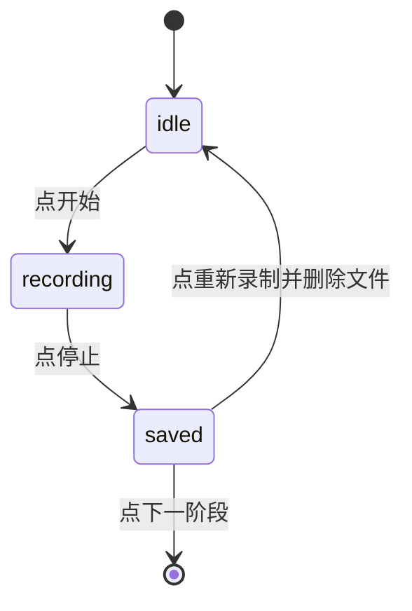
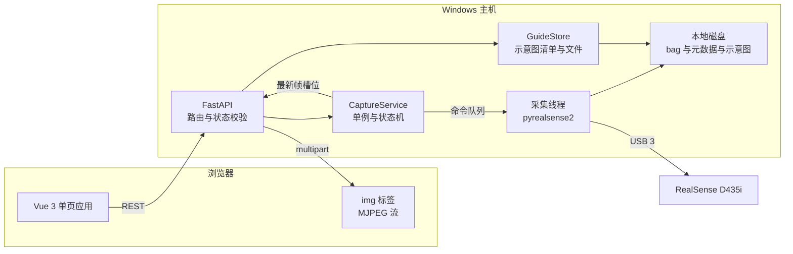
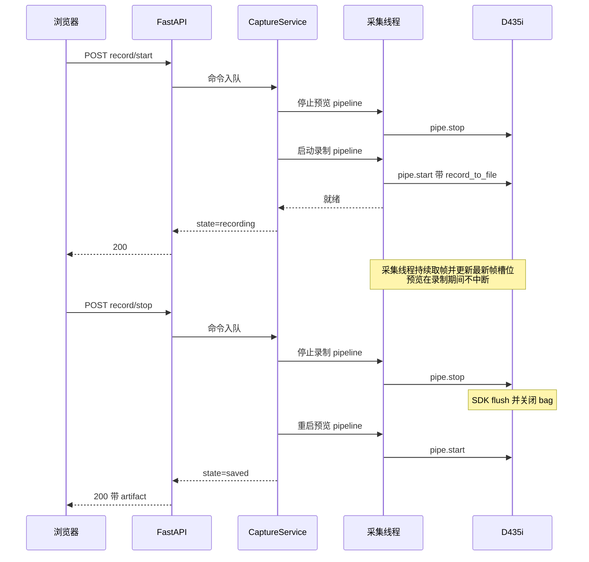

# D435i 数据采集系统设计文档

版本 v0.9
日期 2026-10-05

v0.9 变更点。采集主机统一为 Windows。原先部署形态写的是 Ubuntu 主机，示例路径与允许浏览的根部也是 POSIX 形态，现全部改为 Windows 主机、Windows 路径与盘符。代码里的跨平台处理保留不变。

v0.8 变更点。接口评审后同步。明确创建会话要求相机可用，这是三项前置条件里唯一采集员无法在当前页面自行解决的一项。配置新增目录浏览的允许范围。会话内的阶段改为自描述，携带操作说明与时长上下限。

v0.7 变更点。主页的项目目录改为逐级浏览的选择器，由服务端提供目录枚举。说明为什么浏览器没有可用现成控件。

v0.6 变更点。新增项目目录配置与会话命名。主页可设置数据存放目录，新建会话时必须命名，数据落到 `<项目目录>/<会话名称>/`。就绪判断新增项目目录一项。

v0.5 变更点。前端已实现并跑通全流程，代码在 `frontend/`。界面文案定为英文。样式改为手写设计令牌，不再用 Tailwind。新增模拟后端，可在无相机无后端服务的情况下完整评审界面。

v0.4 变更点。文档拆分为三份，页面逻辑移入 `docs/FRONTEND.md`，接口契约与数据模型移入 `docs/API.md`，本文只保留需求、架构、配置、数据、相机、风险与里程碑。

v0.3 变更点。明确示意图持久化要求，配置一次后重启不要求重配，补充启动自检与恢复策略。

v0.2 变更点。新增主页与示意图配置功能，确认黑屏可接受，录制流选择标记为待定。

---

## 文档索引

| 文档 | 内容 |
| --- | --- |
| `docs/DESIGN.md` | 本文。需求、技术选型、总体架构、配置、数据落盘、相机与录制设计、风险、里程碑 |
| `docs/FRONTEND.md` | 前端页面逻辑、交互规则、按钮渲染、状态管理、异常处理 |
| `docs/API.md` | 后端接口契约、数据模型、错误码、持久化与恢复、实现约定 |

三份文档的分工是需求与架构在本文，面向人的交互在前端文档，面向机器的契约在接口文档。改接口时先改 `docs/API.md`，再同步 `src/api/types.ts` 与前端页面。

---

## 1. 需求

### 1.1 目标

为数据采集员提供一个基于浏览器的采集工具，通过 Intel RealSense D435i 录制八组原始数据，每组数据以 RealSense bag 文件形式落盘到本地。

### 1.2 使用者与场景

使用者是数据采集员，不假设其具备命令行能力。采集员坐在装有 D435i 的 Windows 主机旁边，用另一台机器的浏览器访问采集页面，按引导逐阶段完成录制。

### 1.3 功能需求

| 编号 | 需求 | 说明 |
| --- | --- | --- |
| F1 | 阶段引导 | 共八个阶段，每阶段先展示一张示意图，点下一步才进入采集页 |
| F2 | 实时预览 | 采集页实时显示 D435i 图像 |
| F3 | 开始录制 | 点开始后相机开始写入 bag 文件 |
| F4 | 停止并保存 | 点停止后结束写入，文件落盘并生成元数据 |
| F5 | 重新录制 | 删除本次刚录制的文件，允许重录一次 |
| F6 | 单次约束 | 开始按钮点击一次后置灰，只有点重新录制才能再次激活 |
| F7 | 阶段推进 | 保存完成后才可进入下一阶段 |
| F8 | 一轮结束 | 八个阶段全部保存后进入结束页 |
| F9 | 重新开始 | 结束页可开启新一轮采集 |
| F10 | 配置化 | 阶段的名称、操作说明与采集参数由后端 YAML 文件定义，改配置不改代码 |
| F11 | 主页配置入口 | 主页提供示意图配置入口，采集员可上传八个阶段各自的示意图 |
| F11.1 | 阶段描述可编辑 | 示意图配置页上每个阶段除示意图外还可编辑一段描述，保存后覆盖 YAML 的默认文案，清空则恢复默认 |
| F12 | 就绪校验 | 八个阶段的示意图全部配置完成后，才允许开始新一轮采集 |
| F13 | 示意图可替换 | 已上传的示意图可单独替换或删除，无需重做全部 |
| F14 | 示意图持久化 | 配置结果落盘保存，关闭并重新打开软件后依然生效，不要求重新配置 |
| F15 | 免打扰 | 八个阶段已齐备时，主页不再提示配置，也不自动跳转到配置页 |
| F16 | 项目目录配置 | 主页可设置数据存放目录，改动持久化到主机，重启后依然生效 |
| F17 | 会话命名 | 新建会话时必须指定名称，用于在项目目录下建立同名子目录 |
| F18 | 落盘位置可预览 | 创建会话前显示完整的目标路径，建立后数据一律写入该目录 |
| F19 | 中途中断 | 任意阶段的引导页与采集页都可返回主页，会话保留为进行中，已保存的录制不受影响 |
| F20 | 前置条件阻止开工 | 相机可用、项目目录可用、示意图齐备，三项全满足才允许创建会话 |

### 1.4 目录与命名规则

数据落盘的位置由两层拼成。

```text
<项目目录>/<会话名称>/
```

例如项目目录设为 `C:\Users\ch7au\Documents\Project_A`，会话命名为 `session_a`，则该轮所有采集数据都在 `C:\Users\ch7au\Documents\Project_A\session_a\` 下面。每一轮一个目录，目录名就是采集员自己起的名字，这一点是方便人工整理与交接的关键。

**项目目录**。必须是绝对路径，允许以 `~` 开头表示主机用户主目录。不允许包含 `..`。不允许是文件系统根。目录不存在时由服务创建。服务会在保存前校验可写性与剩余空间，任一不满足则拒绝保存并保留原值。

设置方式是主页上的一个逐级浏览的选择器，像选保存位置那样一层层点进去。浏览器本身没有可用的现成控件能做到这一点，原因有三层。原生目录选择框浏览的是打开浏览器的那台机器，而数据要写到插着相机的主机。能取到绝对路径的 `showDirectoryPicker()` 返回的是不透明句柄，服务端拿不到可用路径。文件选择框则根本不能选目录。因此目录枚举必须由服务提供，选择器必须自建。具体的方案对比与交互细节见 `docs/FRONTEND.md`。

**会话名称**。允许字母、数字、点、短横线与下划线，首字符必须是字母或数字。长度上限 64。不允许路径分隔符与 `..`，也不允许以点开头，因此不可能越出项目目录。同名目录已存在时拒绝创建，避免覆盖已有采集数据。

**为什么用名称而不是时间戳**。原先的自动编号虽然不会冲突，但事后需要对照日志才能知道哪个目录是哪个对象。用采集员自己起的名字可以直接翻目录找到想要的数据。代价是需要人工避免重名，这一点由创建前的校验与自动建议名称来兼顾。

**中断与丢弃的区别**。采集员可以从任意阶段返回主页，这叫做中断，不叫做丢弃。中断只把当前页面放下，会话在后端仍旧是进行中，已保存的 bag 文件原封不动，主页会变成继续或丢弃二选一。丢弃则是删除整个会话目录，是不可逆操作，必须二次确认。两者共用同一个主页，但语义必须区分清楚，否则采集员会不敢离开页面。

### 1.5 阶段状态定义

每一阶段在其生命周期内处于以下三种状态之一。

| 状态 | 含义 |
| --- | --- |
| `idle` | 尚未录制，或已丢弃上次录制 |
| `recording` | 正在录制 |
| `saved` | 已保存，可以推进或重录 |



每种状态下哪些动作被允许，以及非法调用返回哪个错误码，见 `docs/API.md` 的状态与动作一节。前端按钮的呈现规则见 `docs/FRONTEND.md`。

### 1.6 非功能需求

| 项 | 要求 |
| --- | --- |
| 部署形态 | 后端与相机在同一台 Windows 主机，浏览器通过局域网访问 |
| 并发 | 同一时刻只允许一个采集员操作，服务端做单例保护 |
| 预览延迟 | 端到端不超过 500 毫秒 |
| 磁盘保护 | 剩余空间低于阈值时拒绝开始录制，单次录制有最大时长上限 |
| 掉线恢复 | 浏览器刷新后能读回当前会话与阶段状态，不丢已保存数据 |
| 数据格式 | bag 文件必须可被 realsense-viewer 与 rosbag2 直接读取 |
| 使用范围 | 团队内部工具，不对外发布，不做鉴权与多租户 |
| 交互容忍度 | 录制切换时的预览黑屏可接受，团队已确认，不需要为消除黑屏引入额外复杂度 |
| 示意图约束 | 支持 PNG 与 JPEG，单张体积有上限，引导页按容器宽度自适应显示 |
| 示意图持久化 | 示意图与清单存放在磁盘的固定目录，服务重启、机器重启、代码升级后均不丢失。不得存放在临时目录或内存中 |
| 一次性配置 | 配置齐备后无需任何启动参数或开关，直接进入采集即可。配置只在采集员主动修改时才发生变化 |
| 项目目录持久化 | 项目目录设置在主机侧落盘，服务重启后依旧生效。不得依赖浏览器本地存储 |
| 目录隔离 | 会话名称经过字符白名单校验，不接受路径分隔符，保证任何一轮的数据都不会写到项目目录之外 |

### 1.7 范围外

- 不做数据标注与质量评判
- 不做多相机并行采集
- 不做用户账号与权限体系
- 不做云端上传，数据只落本地磁盘

---

## 2. 技术选型

### 2.1 后端 Python

选用 **FastAPI** 加 **Uvicorn**。理由如下。

- 原生支持异步流式响应，MJPEG 视频推流实现干净
- 依赖 Pydantic 做配置与请求体校验，接口契约自动生成 OpenAPI 文档
- 接口写成同步函数时会被自动放到线程池执行，正好匹配 pyrealsense2 的阻塞式调用
- 部署只需一条 uvicorn 命令，无额外中间件

相机层采用 **pyrealsense2**，图像编码采用 **opencv-python-headless**，配置解析采用 **PyYAML**，示意图解码与缩放采用 **Pillow**。

持久化不使用数据库，直接用文件系统加 JSON 清单。理由是数据量极小，只有八个阶段的条目，引入 SQLite 或其它存储只会增加部署与备份的负担，而文件目录本身便于采集员直接查看和手工替换。清单写入配原子重命名与备份文件，可靠性已经足够。

### 2.2 前端

选用 **Vue 3 加 Vite 加 TypeScript**，样式用手写设计令牌加组件内 scoped 样式，不使用 CSS 框架。选型理由、工程结构、设计方向与运行方式见 `docs/FRONTEND.md`。

界面文案为英文。字体通过 `@fontsource` 自托管并打包进产物，因为采集现场的内网可能没有外网。

前端配有一个浏览器内的模拟后端，默认在 `npm run dev` 下启用。没有相机、后端还没写的情况下，五个页面与全部状态流转都可以完整演示和评审。生产构建通过 Vite 别名彻底排除模拟代码。

### 2.3 为什么不选其他方案

| 方案 | 不采用的原因 |
| --- | --- |
| WebRTC 推流 | 延迟最低但需要信令服务与 STUN 配置，采集场景对延迟不敏感，收益不抵复杂度 |
| Flask | 同步模型下 MJPEG 推流需要额外线程池配置，且缺少 Pydantic 校验 |
| React | 对本项目体量偏重，状态与样板的代码量高于 Vue |
| 桌面端 PyQt | 与需求中的 web base 不符，且不支持远程访问 |

---

## 3. 总体架构



### 3.1 线程模型

这是整个系统最需要小心的地方。D435i 是独占设备，同一时刻只能有一个 pipeline 持有它，因此相机访问必须串行化。

| 线程 | 职责 |
| --- | --- |
| Uvicorn 事件循环 | 处理 HTTP 请求，服务 MJPEG 流 |
| 采集线程 | 独占 pipeline，循环取帧，编码 JPEG，写 bag 由 SDK 内部完成 |
| 接口线程池 | 执行同步接口函数，向采集线程投递命令并等待结果 |

三条通道的通信方式如下。

- REST 命令通过 `queue.Queue` 投递给采集线程，接口线程用 `threading.Event` 等待命令完成
- 预览帧通过一个只保留最新一张的槽位传递，配 `threading.Condition` 唤醒等待者
- 采集线程只保留最新帧，不排队，避免预览画面越播越滞后

三把锁各自负责一件事，不要合并成一把大锁。会话锁保护状态机，保证不会出现两个浏览器同时发出录制命令。清单锁保护示意图清单的读改写。帧槽位条件变量负责最新帧的发布与等待。

示意图存储是独立于相机的另一路。它不碰 pipeline，只碰文件系统，因此走接口线程池同步处理即可，唯一需要串行化的是清单的读改写。这样上传大图时不会阻塞采集线程。

模块划分与更细的实现约定见 `docs/API.md` 的后端实现约定一节。

---

## 4. 配置文件

后端读取 `config/stages.yaml`。阶段数量、名称、录制参数与目录位置全部在这里定义。注意服务目录与项目目录是两件事。

**服务目录**由 YAML 配置，相对固定，采集员在界面上改不了。它存放示意图、日志与设置文件。

**项目目录**由采集员在主页设置，存在 `settings.json` 里，优先级高于 YAML 的 `project.default_root`。采集数据全部落在它下面。

示意图的文件本身不在配置里，只有存放目录在这里配置。阶段名称与操作说明也不在界面上编辑，改文案改 YAML。

```yaml
app:
  title: "D435i 数据采集"
  host: "0.0.0.0"
  port: 8000

paths:
  # 服务自己的工作目录，存放示意图、日志与落盘的设置。
  # 采集数据不在这里，而在下面 project 指定的项目目录里。
  service_dir: "./var"
  guide_root: "./var/guides"
  log_dir: "./var/logs"
  settings_file: "./var/settings.json"   # 存采集员在界面上改的设置

project:
  # 项目目录的初始值，仅在没有 settings.json 时生效。
  # 留空则首次启动时主页要求采集员自己指定。
  default_root: ""
  # 项目目录必须存在或由服务创建，且至少留出这么多空间才能开始录制。
  min_free_space_gb: 5
  require_writable: true

fs:
  # 选择器允许浏览与写入的根部。Windows 上写盘符，列出采集机会用到的卷。
  # 目的是避免把项目目录指到系统目录上，不是安全边界，因为本服务不做鉴权。
  # 当前已配置的项目目录始终视为在范围内，收窄这里不会把正在用的目录锁在外面。
  allow_roots:
    - "~"
    - "C:\\"
    - "D:\\"

guides:
  required: true             # 关掉则示意图缺失时仅告警不拦截会话创建
  max_size_mb: 10
  # PNG 是期望格式，排在首位，文件选择框因此默认筛 PNG。
  # 其余是浏览器可直接显示的常见格式，存储时保持各自的原格式，不做转码。
  allowed_types: ["image/png", "image/jpeg", "image/webp", "image/bmp", "image/gif"]
  # 采集员在示意图页写的阶段描述的长度上限
  instructions_max_length: 500
  display_max_width: 1600    # 超过则生成展示副本，引导页加载副本
  recommended_aspect: "4:3"  # 仅在上传后给出提示，不强制
  persist: true              # 关闭后仅在内存中保留，重启即失效，仅供调试
  rebuild_from_dir: true     # 启动时按目录下的文件尝试重建缺失的清单条目
  keep_backup: true          # 写入清单前备份上一版为 manifest.json.bak

camera:
  serial: ""                 # 留空表示使用第一台设备
  reset_on_session_end: false
  preview:
    width: 640
    height: 480
    fps: 15
    jpeg_quality: 80
  recording:
    min_duration_s: 1
    max_duration_s: 300
    colorize_depth: false
    # 待定。保存哪些流需与用户确认，尤其双红外是否必要。
    # 确认后修改本段即可，代码无需改动。
    streams:
      depth:      { width: 848, height: 480, format: z16, fps: 30 }
      color:      { width: 640, height: 480, format: bgr8, fps: 30 }
      infrared_1: { width: 848, height: 480, format: y8,  fps: 30 }
      infrared_2: { width: 848, height: 480, format: y8,  fps: 30 }
      accel:      { format: motion_xyz32f, fps: 63 }
      gyro:       { format: motion_xyz32f, fps: 200 }

storage:
  compress_bag: false
  keep_finished_sessions: true   # 关闭后每轮结束自动清理，便于磁盘紧张的场景

stages:
  - index: 1
    name: "正面平视"
    instructions: "将目标置于画面正中，保持静止，距离约零点五米。"
    max_duration_s: 60
  - index: 2
    name: "左前四十五度"
    instructions: "沿水平方向向左旋转相机四十五度，其余保持不变。"
    max_duration_s: 60
  # 阶段三至阶段八按同样结构补齐
```

阶段数量不做硬编码，后端在启动时统计 `stages` 长度并做连续性与唯一性校验。校验失败则拒绝启动并打印具体问题。

阶段名称只能在 YAML 里改并重启服务，改动属于采集流程定义，应当留下痕迹。**阶段的操作说明是例外**，它可以在示意图配置页上逐阶段改写，写入清单的 `instructions` 段，并覆盖这里的 `instructions`。这样采集员调整文案不必改文件也不必重启。效果范围与优先级见 `docs/API.md` 的示意图条目一节。

`paths` 下的目录是长期驻留的，不要指向系统临时目录。部署时建议改成绝对路径，避免因为启动目录不同而指向不同位置。

示意图的文件名不出现在配置里。引导页实际加载的是 `/api/guides/{index}/image`，后端按阶段序号去清单里查对应的文件。这样配置与素材彻底解耦，采集员在网页上换图不需要重启服务。

阶段描述同理，配置里只放一份出厂默认文案，采集员写的版本存在清单里，两者不互相覆盖。

---

## 5. 数据落盘结构

```text
<服务目录>/
  settings.json          # 采集员在界面上改的设置，目前只有项目目录
  guides/
    manifest.json
    manifest.json.bak
    stage_01.png
    stage_01.display.jpg
  logs/
    app.log

<项目目录>/
  session_a/
    session.json
    session.log
    stage_01/
      capture.bag
      meta.json
      thumb.jpg
    stage_08/
      capture.bag
      meta.json
      thumb.jpg
  session_b/
    ...
```

上面两块是两套不同的东西，不要混在一起看。

`<服务目录>` 是服务自己的工作目录，存放示意图、日志与落盘的设置。它的位置相对固定，由 YAML 的 `paths` 配置，采集员在界面上改不了。

`<项目目录>` 是采集数据的存放地，由采集员在主页设置。它里面只放会话目录，一轮一个，目录名就是采集员起的会话名称。采集员拿去归档、拷贝、交接的就是这个目录。

因此示意图与日志不在项目目录里。项目目录下除了会话子目录没有别的东西，把整个目录拷走就是一份干净的数据集，不会带上服务的内部文件。

各 JSON 文件的字段结构见 `docs/API.md` 的持久化与恢复一节。这里只说明三件事。

**两套生命周期**。服务目录里的示意图长期驻留，跨会话与跨重启存活。项目目录里的会话按轮次归档，一轮结束后不再改动。两者互不引用，因此清理历史会话、换一批示意图、把整个项目目录拷贝走，三件事互不影响。

**示意图的唯一索引**是服务目录下的 `guides/manifest.json`。清单条目指向真实文件，展示副本以 `.display.` 中缀命名，与原件共存，原件永不丢失。清单里的 `instructions` 段另存采集员写的阶段描述，与 `stages` 平级而不是嵌在条目里，因此删除示意图不会连带丢掉文案。

**会话状态的权威来源**是内存中的状态机，`session.json` 是它的持久化镜像。服务重启时扫描项目目录，恢复未完成会话的状态，保证刷新和重启都不丢数据。

### 5.1 示意图的持久化与恢复

这一节是业务上的硬需求，单独列出。核心要求是配置一次即长期生效，重新打开软件不要求重新配置。

示意图文件与清单都放在磁盘上的固定目录，由 `paths.guide_root` 指定。需要明确禁止的几种做法。不放系统临时目录，重启机器会丢。不放内存，进程退出会丢。不放到相对路径会随工作目录漂移的地方，例如从不同上级目录启动服务时要指向同一个绝对位置。

服务启动时按顺序做六件事，示意图部分包括创建目录、读清单、逐条校验文件、校验版本并迁移、载入内存，最后再扫描项目目录恢复未完成会话。清单与文件不一致时的四种处理分支见 `docs/API.md` 的启动自检一节。

清单的 `version` 字段用于迁移。升级后若发现版本低于当前支持的版本，则在启动时做一次迁移并写回新版本。只要数据目录不被删除，代码更新不会导致重新配置。

若将来用容器部署，必须把示意图目录挂载成卷。否则容器重建时示意图会全部丢失，这就违背了本项要求。当前先以直接运行的方式部署，但设计上留出这个约束。

---

## 6. 相机与录制设计

### 6.1 两套 pipeline 配置

预览与录制对分组要求不同，因此维护两套配置。

| 维度 | 预览配置 | 录制配置 |
| --- | --- | --- |
| 流 | 彩色，必要时加深度 | 待定，见下方说明 |
| 分辨率 | 640 乘 480 | 按 YAML，深度与红外建议 848 乘 480 |
| 帧率 | 15 | 30 |
| 录制文件 | 无 | `enable_record_to_file` |
| 用途 | 只做 JPEG 编码给人看 | 全量落盘 |

录制流的选择目前是待定项。本文件暂按深度与彩色与双红外与加速度与陀螺仪六路设计，实际需要保留哪些由用户确认后修改 YAML 的 `camera.recording.streams` 段。代码侧不写死流列表，因此这项决策可以在 M6 联调前任意时点给出，不会阻塞 M1 到 M4。

只影响体积与带宽，不影响架构。体积参考值是按六路估算的，若双红外被剔除，单阶段文件大约减半。

预览不要开 IMU。IMU 频率远高于图像，放进 `wait_for_frames` 的同步组会拖慢取帧节奏并引入丢帧，而预览并不需要它。

### 6.2 切换时序

librealsense 的录制文件必须在 `pipe.start()` 时通过配置指定，运行时无法给已启动的 pipeline 挂上或摘掉录制。因此开始与停止录制都需要重启 pipeline。



一次切换耗时约零点五到一点五秒，期间预览黑屏。前端在这段时间盖一层遮罩并显示正在准备相机，让等待变得可预期。

### 6.3 预览编码

采集线程从帧组里取出彩色帧，交给 `cv2.imencode` 编码成 JPEG，质量取配置值，然后写入最新帧槽位，同时递增帧序号并通知等待者。

```python
ok, buf = cv2.imencode(".jpg", color_image, [int(cv2.IMWRITE_JPEG_QUALITY), quality])
if ok:
    with self._frame_cond:
        self._latest_jpeg = buf.tobytes()
        self._frame_seq += 1
        self._frame_cond.notify_all()
```

MJPEG 端点在异步生成器里等待帧序号变化再 yield，这样天然做到不积压。

### 6.4 bag 文件兼容性

用 SDK 原生录制而不是自己序列化帧，产出文件可被 realsense-viewer 直接打开，也能被 rosbag2 读取。这一点是选择重启 pipeline 方案而不是手写录制的主要原因。

需要确认一点。librealsense 的 Python 绑定也暴露了 `rs.recorder(path, device)` 与 `pause` 和 `resume` 方法。理论上可以在 pipeline 一直运行的前提下开关录制，从而完全消除预览黑屏。

团队已确认黑屏可以接受，且这是内部工具，因此本项不列入开发计划。仅在此处备录，作为将来若有必要再评估的备选路径。

### 6.5 时间戳

IMU 与深度共享硬件时钟，这是 D435i 的设计。因此 bag 内部各流天然可对齐，无需额外处理。若要做跨设备的会话对齐，可以打开 `rs.option.global_time_enabled`。

### 6.6 相机参数一致性

数据质量依赖相机参数在八阶段之间保持一致。建议在会话开始时显式设定一次并冻结，不要用自动模式。

```python
depth_sensor.set_option(rs.option.enable_auto_exposure, 0)
depth_sensor.set_option(rs.option.exposure, 33000)
depth_sensor.set_option(rs.option.visual_preset, int(rs.rs400_visual_preset.high_accuracy))
depth_sensor.set_option(rs.option.laser_power, 150)
```

具体数值需要在实际采集环境下标定，写进 YAML 的 `camera.controls` 段，由会话创建时应用一次后不再改动。

---

## 7. 风险与对策

| 风险 | 影响 | 对策 |
| --- | --- | --- |
| pipeline 重启导致预览黑屏约一秒 | 采集员误以为出错 | 团队已确认可接受，前端仍盖遮罩加文案，避免无反馈的空白 |
| 示意图未配置齐全就开工 | 引导页空白，流程中断 | 主页显示进度并置灰按钮，创建会话接口二次拦截 |
| 上传的示意图类型或体积不合规 | 引导页渲染异常 | 上传时校验类型与体积并尝试解码，失败即拒绝并保留原图 |
| 示意图换图后浏览器显示旧缓存 | 采集员按错误示意操作 | 图片地址带 `sha256` 前八位作为版本参数 |
| 示意图目录被误删或被临时目录承载 | 重启后要求重新配置，违背核心需求 | 固定目录加启动自检，部署文档写明不得指向临时目录，容器部署时必须挂卷 |
| 清单与实际文件不一致 | 引导页图片加载失败 | 启动时逐条校验，缺失条目移除并告警，其余阶段不受影响 |
| Python JPEG 编码成为瓶颈 | 预览帧率不达标 | 预览降到 15 帧并在 640 乘 480 下编码，必要时改用 turbojpeg |
| bag 文件体积过大 | 磁盘写满 | 配置最大时长上限，开始前检查剩余空间，界面显示已写大小 |
| 采集员忘记点停止 | 录到超时 | 后端自动停止并保存，前端显示倒计时 |
| 浏览器误刷新导致状态错乱 | 半截文件或重复录制 | 状态以后端为准，刷新后重新拉取，离开页面自动停止 |
| 多标签页同时操作 | 设备争用 | 会话单例加接口层锁，后到的请求返回冲突错误 |
| USB 带宽不足导致丢帧 | 数据不完整 | 启动时校验 `usb_type` 为 3.x，占用过高时降低预览帧率 |
| 配置改动导致历史数据无法解释 | 数据不可复现 | 会话创建时冻结配置快照写入 `session.json` |
| 会话重名导致覆盖已有数据 | 采集数据被静默覆盖 | 创建前校验同名目录并拒绝，客户端与服务端各拦一次 |
| 会话名称含路径分隔符 | 数据写到项目目录之外 | 字符白名单限制，不接受斜杠与上级目录，服务端做同样校验 |
| 项目目录被换到别的卷 | 剩余空间判断与实际写入位置不一致 | 空间校验始终针对当前项目目录，切换后重新探测并在界面上刷新 |
| 项目目录不可写或空间不足 | 录到一半失败 | 保存时即校验可写性与空间，不通过则拒绝保存并保留原值；主页常驻显示状态 |
| 项目目录被误删 | 会话目录丢失，引导页与录制均无法进行 | 主页状态变为不可用并给出原因，已确认的会话不受影响，重新指向即可继续 |
| 采集员中途离开页面被误认为数据丢失 | 不敢离开或反复确认 | 中断与丢弃严格区分，中断不删任何文件，界面文案与提示都明确写出这一点 |

---

## 8. 里程碑

| 阶段 | 内容 | 产出 |
| --- | --- | --- |
| M1 | 相机服务与预览流 | 命令行下能稳定输出 MJPEG，验证帧率与延迟 |
| M2 | 录制开关与落盘 | 能手工触发开始与停止，bag 可被 realsense-viewer 打开 |
| M3 | 会话状态机与接口 | 全部接口可用，OpenAPI 文档可读 |
| M4 | 示意图存储与管理接口 | 上传与替换与删除可用，清单与展示副本正确生成，重启后状态不丢 |
| M5 | 前端骨架与路由 | 已完成。五个页面、全部状态流转、路由守卫已实测通过，模拟后端可独立演示 |
| M6 | 项目目录与会话命名接口 | 目录设置可保存并重启后生效，会话按名称建目录，重名与非法名称被拒绝 |
| M7 | 前后端联调 | 把 `VITE_USE_MOCK` 置为 false，逐个接口对齐字段与错误码 |
| M8 | 异常路径 | 刷新、超时、磁盘不足、示意图缺失、设备掉线、目录不可写逐一验证 |
| M9 | 持久化与恢复验证 | 重启服务、重启机器、换浏览器分别验证不要求重新配置；校验目录被删与单图被删两种异常 |
| M10 | 现场试用与调参 | 相机参数、录制流与时长上限按实际场景确定 |

前端已完成的部分不依赖硬件，可以先行验收。M5 的产出里无法在模拟后端下验证的有三项，分别是刷新后恢复会话、示意图跨重启保留、项目目录设置跨重启保留，它们分别需要 M3 与 M4 与 M6 的真实实现。

---

## 附录 A 待确认项

按对开发的影响度排序。

**阻塞项**

1. 录制需要保存哪些流。当前按六路设计，需用户确认，尤其双红外是否必要。只影响 YAML，不阻塞 M1 到 M4，需在 M6 联调前确定。
2. 单个阶段的建议录制时长，以及数据目录的最终位置与磁盘容量规划。影响 M8 的参数取值。

**非阻塞项**

3. 八个阶段的名称与操作说明文案。启动配置校验需要，但可以先用占位文案开发。
4. 是否需要操作员字段与批次备注字段。当前已在接口里预留，可默认留空。
5. 示意图的来源与命名约定。当前按采集员在配置页手工上传设计，若已有一批现成素材，可以加一个一次性导入脚本。
6. 示意图是否需要标注功能，例如在图上画箭头或文字框。当前不做，若有需求建议先在外部的图片工具里处理好再上传。
7. 部署方式与数据目录的最终绝对路径。若将来上容器，需在本阶段就确定卷的挂载点，避免上线后再调整。

前端相关的待确认项见 `docs/FRONTEND.md`。
