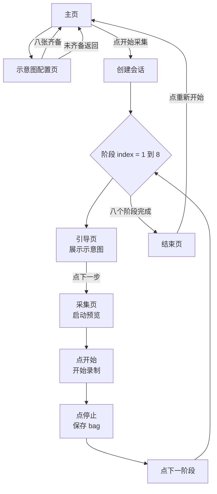

# 前端设计文档

版本 v0.11
日期 2026-09-21

v0.11 变更点。主页项目卡片不再显示该目录下已有的会话数量。这一行与选择器底部的提示重复，而选择器的提示更贴近决策发生的时机，主页只保留项目名与完整路径。后端同步移除了 `project.session_count` 字段。

v0.10 变更点。目录选择器改为只在点击 Browse folders 时打开。原先会在首次运行时自己弹出，把主页的状态展示打断了，而采集员打开主页可能只是想看一眼状态。

v0.9 变更点。接口评审后同步。阶段文案与时长上限改从会话里的阶段对象读取，不再读实时配置，避免中途改 YAML 造成界面与后端限制不一致。阶段对象补上最短时长，采集页据此提前提示。选择器的会话提示改由服务端标记判定，修掉了首次运行时该提示不显示的问题。目录浏览新增允许范围，越界显示为到顶。

v0.8 变更点。阶段引导页与采集页都可以返回主页中断会话。项目卡片不再展示剩余空间。弹窗与遮罩改用进入时的 CSS 动画，不再使用 Vue 的 Transition，因为帧被节流时过渡的移除步骤不会执行，会把弹窗永久留在页面上。

v0.7 变更点。主页的项目目录改为逐级浏览的选择器，新增 `FolderPicker` 组件与浏览目录、新建目录两个接口。说明为什么浏览器没有可用现成控件，选择器必须自建。

v0.6 变更点。主页新增项目目录配置卡片，新建会话改为先命名再创建。新增新建会话对话框与名称校验模块。

v0.5 变更点。前端代码已落地，本文按实际实现校正。界面文案统一为英文。样式改为手写令牌加组件内样式，不再使用 Tailwind。补充模拟后端与运行方式。

---

## 1. 技术选型

### 1.1 主方案

选用 **Vue 3 加 Vite 加 TypeScript**。

- 页面本质是一个状态机驱动的向导，Vue 的响应式与计算属性正好表达阶段状态与按钮可用性
- 组合式 API 把阶段状态收敛到一个模块级单例，八个阶段复用同一套逻辑
- Vite 开发服务器自带代理，本地调试时无需处理跨域
- 构建产物是纯静态文件，由 FastAPI 直接托管，部署只多一个目录
- 模板语法对 Python 背景的开发者友好，上手成本低于 React

样式**不使用 Tailwind**，改为一份设计令牌文件加各组件自己的 scoped 样式。理由是这套界面只有十一个组件，样式规则总量不大，令牌集中在 `styles/tokens.css` 里反而比原子类更容易读懂和调整。改一处颜色只需要动一个变量。

### 1.2 设计方向

定位是仪器面板，不是消费级产品。具体约定如下。

- 底色是偏暖的浅灰，卡片是纯白，结构靠一像素发丝线分隔，不靠阴影堆叠
- 全局只有一个强调色，深青绿，只用于主操作按钮
- 状态色三种。深绿表示已保存或已配置，锈橙表示正在录制，红色表示错误
- 标题用 Instrument Serif，界面文字用 Instrument Sans，所有数字、编号、时间戳、体积用 IBM Plex Mono 等宽字体加表格数字对齐
- 字体通过 `@fontsource` 包自托管，打包进产物。实验室内网没有外网时也能正常显示，这一点是刻意的
- 动画短促克制，只用在一百八十毫秒的过渡与录制指示灯的呼吸效果上

### 1.3 工程结构

```text
frontend/
  index.html
  vite.config.ts          # 别名、代理、后端选择
  tsconfig.json
  tsconfig.node.json
  env.d.ts                # __USE_MOCK__ 全局声明
  package.json
  .env.development        # VITE_USE_MOCK=true，走模拟后端
  .env.production         # VITE_USE_MOCK=false，走真实接口
  src/
    main.ts
    App.vue               # 应用外壳，算轨道状态，装配头部与提示层
    router/
      index.ts            # 路由表与守卫
    api/
      index.ts            # 导出 api 与 isMock，后端由别名决定
      types.ts            # 与 API.md 一一对应的数据模型
      error.ts            # ApiError 与 request 封装
      real.ts             # FastAPI 客户端
      mock.ts             # 浏览器内模拟后端
      errorText.ts        # 错误码到人话的映射
    composables/
      useApp.ts           # 配置、健康状态、项目目录、就绪判断
      useBootstrap.ts     # 首屏装载的单一 Promise
      useSession.ts       # 会话与阶段状态，含轮询
      useGuides.ts        # 示意图清单与增删改
      useCountdown.ts     # 本地计时器
      useToast.ts         # 提示消息
    utils/
      format.ts           # 体积、时长、时间戳、阶段文案
      flow.ts             # 会话到应处位置
      sessionName.ts      # 会话名称与项目路径的校验规则，与后端共用
    views/
      HomeView.vue
      GuidesView.vue
      StageGuideView.vue
      CaptureView.vue
      FinishView.vue
    components/
      AppHeader.vue
      StageRail.vue
      StatePill.vue
      AppButton.vue
      GuideCard.vue
      PreviewPane.vue
      CaptureControls.vue
      StageResultGrid.vue
      FolderPicker.vue
      NewSessionDialog.vue
      BlockingOverlay.vue
      ConfirmDialog.vue
      ToastStack.vue
    styles/
      tokens.css          # 全部设计令牌
      base.css            # 重置、排版、通用类
```

`api/types.ts` 里的类型定义要与 `docs/API.md` 的字段保持同名同义，接口调整时两边同时改。

`utils/paths.ts` 是一个特例，它同时被前端与模拟后端引用。名称与路径的校验规则写在两处一定会逐渐不一致，所以收敛成一个模块，真实后端的实现再重复一遍相同的规则。项目目录选择器与新建会话对话框公用这一份规则，因此选择器里能建出来的目录名，一定可以直接用作会话名。

### 1.4 不采用的方案

| 方案 | 不采用的原因 |
| --- | --- |
| React | 对本项目体量偏重，状态与样板的代码量高于 Vue |
| Tailwind | 组件数量少，令牌集中管理比原子类更易读 |
| WebRTC 推流 | 延迟最低但需要信令服务与 STUN 配置，采集场景对延迟不敏感，收益不抵复杂度 |
| 桌面端 PyQt | 与需求中的 web base 不符，且不支持远程访问 |

---

## 2. 模拟后端

没有相机或后端服务时，前端可以完全独立运行，这是首版开发的默认状态。

`vite.config.ts` 按 `VITE_USE_MOCK` 把 `@api-backend` 别名指向 `api/mock.ts` 或 `api/real.ts`。用别名而不是运行时三元表达式，是因为三元表达式会把两个模块都留在依赖图里，模拟模块在顶层就初始化了数据，摇树删不掉它。别名从根上保证了生产包不含模拟代码。

模拟后端实现了完整的 `CaptureApi`，包括以下能力。

- 八个阶段的名称与操作说明，与真实配置结构一致
- 八张程序生成的 SVG 姿态示意图，含方位角、俯仰角、距离三个标注
- 完整的会话生命周期，含状态机校验、错误码、录制超时自动停止、过短录制自动丢弃
- 一块 canvas 上绘制的合成相机画面，深色冷调，带漂移的物体与扫描线，用来验证预览区布局
- 每次读取都返回深拷贝。真实 HTTP 响应天然是新对象，这一点是 Vue 响应式能正常工作的前提

界面右上角会显示一个 Mock 徽标，任何时候都不会被误认为真机运行。

**模拟后端的一项限制**。所有状态都在内存里，浏览器整页刷新会清空。因此刷新后恢复会话与示意图持久化这两件事，只能在接上真实后端后验证。这是刻意的取舍，模拟后端的职责是让界面可评审，不是替代后端存储。

---

## 3. 路由与页面结构

### 3.1 路由表

| 路由 | 页面 | 说明 |
| --- | --- | --- |
| `/` | 主页 | 设备状态、示意图进度、存储余量、开启新一轮 |
| `/guides` | 示意图配置页 | 上传、预览、替换、删除八个阶段的示意图 |
| `/guide/:index` | 引导页 | 展示第 index 阶段示意图与操作说明 |
| `/capture/:index` | 采集页 | 实时预览与录制控制 |
| `/finish` | 结束页 | 展示本轮结果汇总，按钮开启新一轮 |

未匹配的路径一律回主页。

### 3.2 路由守卫

守卫不信任 URL，判定依据始终是后端的会话对象。它还会在状态为空时按需装载会话，这是页面刷新后不丢流程位置的关键。

装载顺序是先看健康检查返回的 `active_session.session_id`，没有再退回 `sessionStorage` 里记下的上一次会话标识。后者是为了让结束页在误刷新后还能打开，它只用于定位，不参与任何就绪判断，就绪与否始终以后端为准。

| 目标 | 校验 | 不通过时 |
| --- | --- | --- |
| `/guides` | 无 | 总是允许，采集员可随时修改示意图 |
| `/guide/:index` | 存在会话，且 `index` 不大于 `current_stage` | 重定向到应处位置 |
| `/capture/:index` | 同上，且该阶段状态不是 `saved` | 已保存则回到该阶段引导页 |
| `/finish` | 会话状态为 `finished` | 重定向到应处位置 |

会话已结束时，除结束页外的任何流程页面都直接回结束页。所有重定向的目标由 `utils/flow.ts` 的单一函数给出，避免流程顺序出现第二份定义。

实测行为如下表，与设计一致。

| 场景 | 结果 |
| --- | --- |
| 当前处于第二阶段，访问 `/guide/2` | 允许 |
| 当前处于第二阶段，访问 `/guide/1` | 允许，早期阶段可回看 |
| 当前处于第二阶段，访问 `/guide/7` | 回到 `/guide/2` |
| 当前处于第二阶段，访问 `/guide/99` | 回到 `/guide/2` |
| 当前处于第二阶段，访问 `/capture/1` | 回到 `/guide/2` |
| 会话未结束，访问 `/finish` | 回到 `/guide/2` |
| 会话已结束，访问 `/guide/1` 或 `/capture/3` | 回到 `/finish` |

### 3.3 组件职责

| 组件 | 职责 |
| --- | --- |
| `AppHeader` | 品牌标识、页面侧信息槽位、Mock 徽标、阶段轨道 |
| `StageRail` | 八段进度条，全应用唯一的常驻进度指示 |
| `StatePill` | 阶段状态胶囊，录制时指示灯呼吸 |
| `AppButton` | 四种外观，三档尺寸，含加载态与统一的禁用态样式 |
| `GuideCard` | 单阶段示意图卡片，含点击上传、拖拽、替换、删除、卡片内错误 |
| `PreviewPane` | 承载 MJPEG 图或 canvas，锁定 4:3，含未启动与断流状态 |
| `CaptureControls` | 四颗录制控制按钮，固定 2x2 网格，可用性由 `allowed_actions` 推导 |
| `StageResultGrid` | 结束页的八张结果卡片，含缩略图与关键数值 |
| `BlockingOverlay` | 录制切换期间覆盖预览区，说明正在重配相机 |
| `ConfirmDialog` | 二次确认，支持 Escape 关闭 |
| `ToastStack` | 右下角提示堆叠，错误不自动消失 |

---

## 4. 主流程



八个阶段共用同一套页面组件，只有 `index` 与后端返回的阶段数据不同。流程图上是一个循环，实现上是同一批路由复用。

---

## 5. 页面详细设计

### 5.1 主页

主页是流程入口，三张卡片一行，下方一条操作栏。三张卡片分别是相机、项目目录、阶段示意图，对应开始采集前的三项前置条件。

**Camera 卡片**。展示型号、序列号、固件、链路速率，右上角显示 Connected 或 Not detected。未连接时卡片内直接给出原因文案。

**Project folder 卡片**。这一张承担项目目录的配置，是本节的重点。

已配置且可用时，卡片显示项目名与完整路径。项目名用衬线体大字，取自路径的最后一段。完整路径用等宽小字显示在下方，过长时省略。右上角状态为 Ready，底部是两颗按钮，左边是次要的 Type a path，右边是主要的 Browse folders。

剩余空间刻意不在这里展示。它属于就绪检查的一部分，当空间不足时会以“无法开始采集的原因”这种形式出现，比报一个需要采集员自己判断够不够的数字更直接。

未配置时，卡片提示尚未选择目录，同样给出这两颗按钮，并说明可以直接在选择器里新建目录。右上角状态为 Not set。

这一页不会自己弹出选择器。主页的职责是展示状态，采集员可能只是打开看一眼相机在不在、还剩多少空间，并不想选目录。在他按下 Browse folders 之前，不应该有窗挡住页面。

不可用时，状态改为 Unusable，卡片内用红字给出原因。原因文案直接来自后端的 `error` 字段，前端不做二次拼装，因为只有服务知道到底是权限问题还是空间问题。

保存成功后，响应的 `root` 是服务展开并规范化之后的路径，可能与输入不完全一样，例如末尾的斜杠被去掉，`~` 被展开。界面用返回值刷新，而不是沿用输入的文字，这样显示的是磁盘上真实的位置。

**Stage diagrams 卡片**。进度条加计数，形如 8 / 8。已齐备时文案说明所有示意图都已存在主机上并会跨会话复用，链接措辞为 Review or replace diagrams。未齐备时计数改用琥珀色，链接措辞为 Configure diagrams。

**操作栏**。左侧一句结论，右侧按钮。

| 情形 | 操作栏文案 | 按钮 |
| --- | --- | --- |
| 无进行中会话，三项前置条件全满足 | Ready to record into Project_A | Start new session |
| 无进行中会话，有前置条件不满足 | Not ready to start，下面逐条列出三项检查结果 | Start new session 禁用，整条操作栏转灰底 |
| 有进行中会话 | Session session_a is in progress，并说明已保存几个阶段 | Discard session 与 Resume session |

三项检查以清单形式呈现，每条带勾或点标记加一句说明，让人一眼看出还差什么。三项分别是相机已连接、项目目录已设置、阶段示意图已配置。清单只在有项目不满足时出现，主机一切正常时主页保持安静。

这些状态全部由健康检查接口一次返回，主页不发起第二个请求。判定完全在后端，前端不使用本地存储，因此换机器、换浏览器、清空缓存都不会影响结果。

### 5.2 项目目录选择器

点 Browse folders 弹出，是一个逐级浏览的目录浏览器。它只在这一颗按钮被按下时打开，首次运行或未配置时也一样。

**为什么必须自己实现**。这是本项目最容易走错的一处技术选择，所以把结论写清楚。浏览器没有任何现成控件能拿到主机上的绝对路径。

| 候选方案 | 为什么不能用 |
| --- | --- |
| `showDirectoryPicker()` | Chrome 与 Edge 有，但它返回一个不透明的句柄对象，不暴露绝对路径，服务端拿不到可写入的目录 |
| `<input type="file" webkitdirectory>` | 只能拿到相对文件名，同样拿不到绝对路径 |
| 用 `accept` 与 `multiple` 的原生文件框 | 只能选文件，不能选目录 |
| 部署成 Electron 包一份桌面应用 | `dialog.showOpenDialog` 确实能给绝对路径，但这就违背了 web base 的需求，且失去多机访问能力 |

更根本的一点是机器不同。原生目录框浏览的是**打开浏览器的那台机器**，而数据要写到**插着相机的那台主机**。采集员在自己的笔记本上访问，即使能拿到路径也是笔记本的路径，对后端毫无意义。

因此选择器必须自建，并且必须由后端逐个目录列出来源。它不是一个可以省的轮子，而是这类部署形态下的必然结果。

**布局**。顶部是标题与一行说明，明确写出正在浏览的是采集主机上的目录，不是本机。下面一条路径栏。主体左窄右宽，左边是常见位置的快捷入口，右边是当前目录的子目录列表。底部是已选目录与三颗按钮。

**路径栏**含三项。Up 按钮在到达浏览范围根部时禁用。面包屑把绝对路径拆成可点击的分段，斜杠开头作为一个独立分段，因此任何时候都能跳回根。右侧是显示隐藏目录的开关，默认关闭，因为主机的隐藏目录对采集员基本无用。

**列表**只列子目录，不列文件。理由是项目目录必须是一个目录，列出文件只会增加噪音。

**列表行**。每行显示目录图标与名称，右侧按需带三个标记。符号链接带 `link`。目录里已有会话时带 `session`，这一条由服务端判断后下发，见下。只读目录带 `read only`，它们仍然列出来并且可以进入，但选中时会被拦下，这样比直接隐去更容易理解。

**新建目录**。底部的 New folder 在当前目录下创建子目录，创建成功后自动进入它。名称规则与会话名称一致，也就是说在这里能建出来的目录，一定可以用作会话名。创建失败的原因包括重名、父目录不可写、名称非法，逐条显示在输入框下方。

**选择校验**。当前目录能否作为项目目录，由三个条件决定，目录可读、服务可写、剩余空间达标。不满足时底部的 Select this folder 按钮禁用，并在旁边直接写出是哪一条不满足，不藏在悬浮提示里。

**会话数量提示**。如果当前目录里已经有会话目录，底部会提示有几个，并列出前三个名字。这让采集员在选定之前就能看出这个目录里已经有什么，避免把两轮数据混到同一个项目里。

这个判断由服务端负责，列表接口的每个条目带一个 `looks_like_session`，也就是该目录下是否存在 `session.json`。前端不自己推断，也不再从会话列表接口取名字去比对。

早先的实现有两个毛病。一是拿会话列表里的名称去匹配目录名，导致首次运行时那个提示永远不显示，因为选择器打开时还没有拉过会话列表。二是选择器会在首次运行时自己弹出，把主页的状态展示打断。现在前者由服务端顺手给出，后者改为只响应点击。

**浏览范围**。服务端按配置限定可浏览的根部，默认是服务用户主目录与几个常见的挂载点。越出范围的目录直接请求会被拒绝。

这个限制对界面的影响很小，因为选择器不需要特殊处理。范围内目录的 `parent` 在到达范围边缘时返回 `null`，与文件系统根的表现完全一致，于是 Up 按钮会自然变灰，面包屑自然停在范围根部。也就是说范围限制对采集员而言表现为“这里就是最上面了”，而不是一个报错。

**键盘**。Escape 关闭对话框，在新建目录的输入框里按 Escape 则先收起创建区。

### 5.3 新建会话对话框

点 Start new session 弹出。这一页存在的唯一目的是给这一轮采集起个名字，并且让人在动手之前就看到数据会落到哪里。

**名称输入**。打开时预填一个建议名称，格式是 `session_` 加当天日期。若该名称已被占用则自动加序号，例如 `session_20260921_2`。预填的名称会整体选中，直接输入即可替换，符合直觉。

**目标路径预览**。输入框下方用一块浅底区域显示完整的目标路径，形如 `/Users/ch7au/Documents/Project_A/session_a/`，随输入实时更新。这块预览是整个对话框的重点，它把名称与落盘位置的关系讲清楚了，采集员不需要去猜。

**校验规则**。名称允许字母、数字、点、短横线与下划线，首字符必须是字母或数字，长度不超过 64。空名称、含斜杠、含空格、以点开头、含上级目录都会被拒绝，错误文案直接显示在输入框下方。重名也会在这里就被拦住，因为打开对话框时已经拉取了项目下已有的会话名称列表。创建按钮在名称合法前保持禁用。

**重名检查的时机**。打开对话框时拉一次会话列表，把已占用的名称拿到前端。这样输入时就能即时提示重名，而不用等提交后由后端报错。后端仍然会在创建时再查一次磁盘，因为列表拉取与创建之间可能有人手工加了目录。

**服务端错误**。若前端校验通过但后端拒绝，错误显示在同一个位置，输入内容不丢失，采集员可以直接改名重试。这一点是刻意的，重新输入一个名字的成本远高于看到错误后改一个字符。

**从结束页也可以新建**。结束页的 Start new session 复用同一个对话框。刚刚结束的那一轮已经在磁盘上，所以它的名称会被列为已占用，不会再被建议使用。

### 5.4 示意图配置页

**头部**是标题、说明与右侧的大号计数。下方是一条四像素进度条，齐备时转绿。

**提示条**。齐备时显示绿色确认文案，未齐备时显示琥珀色提示并说明还差几张。

**主体**是响应式卡片网格，自适应每列 258 像素以上，宽屏一行四张。

**卡片结构**。顶部是阶段编号与已配置勾选标记，下面是阶段名。中间是 4:3 的图片区，未配置时显示虚线框与拖入提示，已配置时显示示意图。底部列出文件名、体积与像素尺寸、上传时间，以及 Replace 与 Remove 两颗按钮。

**上传方式**三种。

- 点击卡片图片区或 Upload 按钮，走文件选择器
- 单张文件直接拖到某张卡片上，归属该阶段
- 多张文件拖到页面空白处，按文件名里的数字推断归属，名称形如 `stage_03.png`

匹配判定放在前端，后端只接受显式带阶段序号的字段名，不做猜文件名的事。批量拖入时无法推断的文件会被跳过并弹提示说明，不会静默丢弃。首版没有做可编辑的归属确认列表，因为文件名约定已经足够稳定，加一层确认表反而增加操作步骤。

**校验反馈**分两处给出。卡片内直接显示红色错误条，同时弹出右下角提示。两种反馈都保留原有示意图不被覆盖。

**持久化说明**。页面加载时从清单接口读回已配置项，八张卡片的初始状态由此渲染。示意图存在后端磁盘上，关掉浏览器、重启服务、换一台机器回来看到的都是同一份配置。

### 5.5 引导页

两栏布局，左侧是示意图，右侧是操作说明。

- 左上角为 Stage 0X of 08 与阶段名，右上角是状态胶囊
- 示意图按容器宽度自适应，最高不超过视口高度的六成
- 右侧说明区列出置位要求，下面是最大录制时长与输出文件名

**主按钮按状态分四种出口**，这一点是实测中发现必须处理的，否则已保存阶段会走成死路。

| 阶段状态 | 按钮 | 行为 |
| --- | --- | --- |
| 未录制 | Next: open capture | 进入采集页 |
| 正在录制 | Return to recording | 回到采集页继续这一条 |
| 已保存且是当前阶段，且是最后一段 | Finish session | 直接结束会话并去结束页 |
| 已保存且是当前阶段，非最后一段 | Next stage | 推进到下一阶段 |
| 已保存但不是当前阶段，属于回看 | Go to current stage | 跳回当前应处位置 |

第二阶段起左侧会出现 Previous stage，允许回看早期阶段的示意图。

**返回主页**。右侧始终有一颗 Back to home，任何时候都可以离开去主页。这一动作的含义是中断当前会话，而不是丢弃它。后端会保留会话的进行中状态，已保存的录制一律不动，主页会变成继续或丢弃二选一。

引导页不涉及录制，因此不需要二次确认，点击就直接走，并弹一条提示说明会话已中断且没有删除任何东西。

### 5.6 采集页

左右两栏。左侧是预览区占满剩余宽度，右侧是固定 340 像素的控制栏。窄屏时上下堆叠。

**预览区**锁定 4:3，与传感器输出一致，流建立前也保持该比例，避免页面跳动。画面上叠两个角标，左上角录制时是锈橙底 REC 加实时计时，保存后转为深绿底 SAVED 加时长，右上角是帧率。

**控制栏**自上而下依次是阶段编号与名称、状态胶囊、数值区、四颗控制按钮、一句状态说明、已保存时追加一张末帧缩略图、最后并排两颗离开按钮，分别是回到本阶段引导页的 Leave this stage，以及回到主页的 Back to home。

**数值区按状态切换**。

| 状态 | 展示项 |
| --- | --- |
| 未录制 | 时长上限、输出文件名 |
| 录制中 | 已录时长、距自动停止剩余时间、当前预估体积 |
| 已保存 | 实际时长、文件体积、保存时刻 |

录制中的体积是按时长乘码率估算的，前缀加波浪号表示这是估计值，用途是让采集员随时知道磁盘占用。

**遮罩**。开始与停止都会触发后端重启 pipeline，前端在这段时间盖上遮罩并显示 Reconfiguring the camera。团队已确认黑屏可接受，遮罩的作用只是让等待有反馈，避免误以为卡死。

**轮询**。录制期间每两秒查一次会话。这是为了感知后端在超时时自行完成的停止与保存，浏览器没有别的方式知道这件事。

**返回主页分两种情况**。录制中按 Back to home 会先弹二次确认，因为离开这一页会终止当前这条拍摄，代价是实打实的，且没有撤销入口。不在录制时，已保存的结果不受影响，未录制的阶段也不受影响，此时不弹确认，直接走。

确认弹窗明确写出两件事，当前这条会被停止并保存已拍到的部分，以及会话本身保持打开可以从主页继续。按钮是 Stop and leave 与 Keep recording，后者是默认的安全选项。

这里刻意不叫放弃或取消，因为两者都不是实情，会话没有被放弃，录制也没有被取消。

**离开后补一次刷新**。停止拍摄是后端在收到通知后才完成的，而主页挂载时的那次健康检查往往早于它完成，会把已保存阶段数少算一条。因此离开时会延迟三秒再查一次会话摘要，让主页上的计数跟得上。

**离开页面**。组件卸载时通知后端停止预览，若仍在录制则后端先自动停止并保存。真实后端用 `sendBeacon` 发送，因为普通 `fetch` 在页面卸载时可能被浏览器取消。模拟后端没有 HTTP 端点，直接调用其方法。

### 5.7 结束页

- 标题为 All stages recorded 或 Session closed，按完成度区分
- 四格摘要，分别是已保存阶段数、总时长、总体积、结束时刻
- 会话标识与数据目录各一行，附 Copy path 按钮
- 八张结果卡片，含缩略图、阶段编号与名称、时长、体积、开始时刻，未录制的阶段显示为虚线卡片并标记 Missing
- 右上角是 Delete session 与 Start new session
- 页脚说明示意图会保留到下一轮，只有录制结果会被清空

---

## 6. 按钮渲染规则

阶段状态的语义与动作合法性由后端定义，见 `docs/API.md` 的状态与动作一节。前端只把 `allowed_actions` 转成视觉状态。

| `allowed_actions` 中的值 | 对应按钮 | 呈现 |
| --- | --- | --- |
| `start` | Start | 深青实心 |
| `stop` | Stop | 录制中转为锈橙实心 |
| `discard` | Re-record | 白底描边，点击后二次确认 |
| `advance` | Next stage 或 Finish session | 深青实心 |

不在列表中的按钮一律禁用。禁用态不是简单降低透明度，而是转成浅灰底加浅灰字，读起来是失效而不是变淡。鼠标悬浮时给出原因文案，文案在前端按状态映射硬编码。

控制按钮固定 2x2 网格，位置不随状态变化，触摸屏上能形成肌肉记忆。

三个容易写错的地方，实现时已经注意。

- 开始按钮点击后立即禁用，不做乐观更新，也不因为本地计时器而提前放开。实现方式是直接依赖后端返回的新状态
- 停止接口返回后要等状态真的变成 `saved` 才显示 Re-record 与 Next stage
- 重新录制成功后要清空计时器，否则会残留上一次的数值

---

## 7. 状态管理

不引入 Vuex 或 Pinia。整个应用只有一份核心状态，就是当前会话对象，用模块级的 `ref` 持有即可，这正是组合式函数的标准做法。

| 组合式函数 | 持有的状态 |
| --- | --- |
| `useApp` | 配置、健康状态、就绪判断与阻塞原因 |
| `useSession` | 会话、阶段、当前进度、轮询与忙状态 |
| `useGuides` | 示意图清单、进度、上传与删除 |
| `useToast` | 提示消息队列 |
| `useCountdown` | 组件内计时器，不是单例 |

约定四条。

- 阶段状态只从后端返回的对象读取，任何时候都不在前端做乐观更新
- 每次动作接口返回后，用返回值整体替换本地会话对象，而不是做字段级合并
- 返回体会话的接口，其会话必须写回状态层再导航。这一条是实测踩出来的，推进阶段后不写回，路由守卫会读到旧状态并把浏览器弹回原处
- 录制期间的倒计时与预估体积属于纯展示，由本地计时器驱动，不参与任何可用性判断

---

## 8. 与后端的交互

### 8.1 各页面调用的接口

| 页面 | 时机 | 接口 |
| --- | --- | --- |
| 主页 | 加载 | 健康检查、配置 |
| 主页 | 打开目录选择器 | 浏览目录 |
| 主页 | 选择器内新建目录 | 新建目录 |
| 主页 | 保存项目目录 | 设置项目目录 |
| 主页 | 点开始采集 | 列出会话，用于重名校验 |
| 主页 | 确认新建 | 新建会话 |
| 主页 | 点继续采集 | 查询会话 |
| 主页 | 点丢弃本轮 | 丢弃会话 |
| 示意图配置页 | 加载 | 示意图清单 |
| 示意图配置页 | 单张上传 | 上传单个 |
| 示意图配置页 | 批量拖入 | 批量上传 |
| 示意图配置页 | 删除 | 删除单个 |
| 引导页 | 加载 | 查询会话 |
| 引导页 | 保存阶段的推进 | 进入下一阶段 |
| 采集页 | 进入 | 启动预览 |
| 采集页 | 轮询 | 查询会话，录制期间每两秒一次 |
| 采集页 | 点开始 | 开始录制 |
| 采集页 | 点停止 | 停止录制 |
| 采集页 | 点重新录制 | 丢弃并重录 |
| 采集页 | 点下一阶段 | 进入下一阶段 |
| 采集页 | 离开 | 停止预览 |
| 结束页 | 加载 | 查询会话 |
| 结束页 | 点重新开始 | 列出会话，然后新建会话 |

### 8.2 预览流

预览用原生图片标签承载 MJPEG 长连接，不做额外封装。

```html

```

进入采集页时先调用启动预览接口，成功后再把地址交给图片标签。顺序反过来会出现先请求流再启动 pipeline 的竞态。流异常断开时显示明确文案而不是空白，不依赖浏览器自动重连。

### 8.3 图片与缓存

示意图地址带 `v` 参数，取清单里的 `sha256` 前八位。替换示意图后指纹变化，浏览器一定会重新拉取。这个参数每次从清单现取，不在本地缓存地址字符串。

### 8.4 错误处理

所有接口的错误体结构统一，见 `docs/API.md` 的通用约定。`api/error.ts` 统一拦截并抛出 `ApiError`，`api/errorText.ts` 把错误码翻成可执行的中文说明，因为后端返回的 `message` 可能随版本调整措辞，`code` 才是稳定契约。

少数错误码需要特殊交互，在业务层处理。

| 错误码 | 前端行为 |
| --- | --- |
| `SESSION_ACTIVE_EXISTS` | 主页展示继续与丢弃两个选项 |
| `RECORDING_TOO_SHORT` | 提示录制过短已丢弃，状态回到未录制，开始按钮恢复可用 |
| `DISK_SPACE_LOW` | 提示清理空间，项目卡片状态转为 Unusable |
| `GUIDES_INCOMPLETE` | 引导去示意图配置页，未配置的卡片高亮 |
| `DEVICE_NOT_FOUND` | 提示检查相机连接，回到主页并刷新健康检查 |
| `CAMERA_ERROR` | 提示相机异常，给出重试路径 |
| `STAGE_NOT_CURRENT` | 提示只能推进当前阶段，刷新会话状态 |
| `PROJECT_PATH_INVALID` | 项目卡片内保留输入，给出路径规则错误 |
| `PROJECT_PATH_NOT_WRITABLE` | 选择器内保留当前位置，Select 按钮禁用并说明原因 |
| `PROJECT_NOT_CONFIGURED` | 主页提示先设置项目目录，并把项目卡片标为 Not set |
| `SESSION_NAME_INVALID` | 新建对话框内保留输入，给出名称规则错误 |
| `SESSION_DIR_EXISTS` | 新建对话框内提示重名，建议另换一个名称 |
| `DIR_NAME_INVALID` | 选择器的新建目录输入框内提示名称规则错误 |
| `DIR_EXISTS` | 选择器的新建目录输入框内提示重名 |
| `DIR_NOT_FOUND` | 选择器刷新当前目录并列出一条提示 |

---

## 9. 异常与边界

| 场景 | 处理 |
| --- | --- |
| 示意图未配置齐全 | 主页开始按钮禁用并说明原因，创建会话接口二次拦截 |
| 项目目录未设置 | 卡片显示 Not set 并给出两颗按钮，开始按钮禁用 |
| 项目目录不可写或空间不足 | 选择器内 Select 按钮禁用并说明是权限还是空间，保存被拒绝时保留原值 |
| 项目目录被删除 | 健康检查报不可用，卡片给出原因，重新指向即可恢复 |
| 会话名称重名 | 对话框内即时提示，创建按钮禁用 |
| 会话名称含非法字符 | 对话框内即时提示，不发起请求 |
| 配置中途关闭页面 | 已上传的示意图保留，回到本页继续 |
| 上传同名文件 | 按阶段序号覆盖，不产生重复文件 |
| 上传类型或体积不合规 | 卡片内红色提示加右下角通知，原图不被覆盖 |
| 采集页刷新浏览器 | 守卫从后端或 `sessionStorage` 取回会话，预览流重新连接 |
| 录制中相机掉线 | 后端标记阶段回到未录制，前端提示并刷新状态 |
| 两个浏览器同时打开 | 后创建会话的请求被拒绝，提示已有进行中的会话 |
| 关闭采集页 | 通知后端停止预览，若正在录制则先自动停止并保存 |
| 接口超时 | 显示可重试错误，写操作不自动重放，避免重复录制 |

---

## 10. 样式与布局约定

- 采集页的预览区是页面主角，占垂直方向绝大部分，控制栏固定宽度不随内容变化
- 按钮最小点击区域 32 像素，主要操作 40 至 52 像素，采集现场常用触摸屏或大屏
- 状态色只有三种，深绿表示完成，锈橙表示录制中，红色表示错误
- 引导页示意图最高不超过视口高度的六成，保证操作说明不用滚动即可看到
- 结束页与结果网格在窄屏下自动降列，不出横向滚动
- 所有交互元素都有可见的键盘焦点环
- 尊重 `prefers-reduced-motion`，此时关闭全部过渡与呼吸动画

### 10.1 弹窗一律不用 Vue 的 Transition

这一条是实测踩出来的，写下来避免以后再踩。

所有弹窗、遮罩与提示都改用进入时的 CSS 动画，也就是挂载时播放一次 `fade-in`，而不再包在 Vue 的 `<Transition>` 里。原因是 Vue 的过渡在离场时依赖一个双重 `requestAnimationFrame` 回调，它要把元素从 `-leave-from` 类推进到 `-leave-to` 类才算走完过场。当页面没有被真正绘制时，浏览器的帧回调会被节流甚至完全不触发，这个回调就一直不执行。

后果很严重。元素会永久停在 `fade-leave-from` 类上留在 DOM 里，而它是一层铺满屏幕的模态遮罩，于是整个界面点不动了。实测时看到的现象很具有迷惑性，读取组件状态显示弹窗已经关闭，但 DOM 节点还在，两边看起来矛盾。真正的线索是连续采样元素的类名，它几十秒一动不动地停在 `fade-leave-from`，同时 `requestAnimationFrame` 的计数始终为零。

只给挂载加动画则没有这个问题。进场有过渡可看，离场就是一次普通的 DOM 移除，不依赖帧回调，不可能失败。

同一条规则适用于 `TransitionGroup`，提示堆叠也因此不再依靠它做进出场。

---

## 11. 运行方式

```bash
cd frontend
npm install
npm run dev        # 模拟后端，默认 http://localhost:5173
npm run typecheck  # 类型检查
npm run build      # 产出 dist，可直接交给 FastAPI 托管
```

开发服务器监听所有网卡，局域网内其他机器可以访问，方便采集员在真实位置试用界面。

默认 `VITE_USE_MOCK=true`，界面右上角会显示 Mock 徽标。后端就绪后把它改成 `false`，`/api` 会经 Vite 代理转发到 `127.0.0.1:8000`。生产构建固定走真实接口。

技术栈版本固定为 Vue 3.5 与 TypeScript 5。TypeScript 7 与当前 `vue-tsc` 3 不兼容，`vue-tsc` 依赖的 `typescript/lib/tsc` 子路径在 7 里已被移除，升级到 7 会导致类型检查无法启动。

---

## 12. 本文档相关待确认项

1. 是否需要深色配色。采集环境光线较暗时深色更护眼，当前未做
2. 三颗控制按钮的文案是否有内部惯用说法，当前为 Start 与 Stop 与 Re-record
3. 是否需要键盘快捷键，例如空格开始与停止
4. 是否需要结束页一键导出清单文件，方便数据交接
5. 项目目录是否需要收藏多个位置一键切换。当前只保留一个，改一次即覆盖
6. 是否需要会话浏览页，列出项目下每一轮的名称、阶段数与体积
